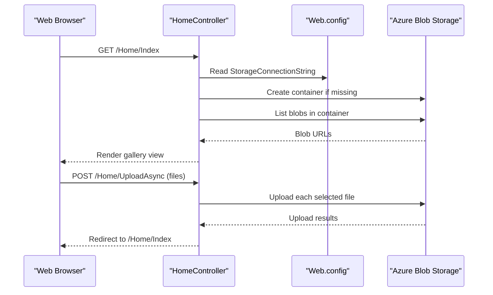

# API & Service Communication Contracts

This application exposes a small MVC-based HTTP surface for browsing and managing a photo gallery. All communication is synchronous between the browser and the web app, while the application performs asynchronous SDK calls to Azure Blob Storage.

## Service Catalog

| Service | Port | Category | Purpose |
|---|---|---|---|
| WebApp-Storage-DotNet | 20050 (IIS Express in project settings) | API Layer | Serves the Razor UI, accepts uploads, lists images, and deletes blobs from the configured storage account |

## API Endpoints Inventory

| Service | Method | Path | Request Type | Response Type |
|---|---|---|---|---|
| WebApp-Storage-DotNet | GET | `/` and `/Home/Index` | None | Razor view with `List<Uri>` model of blob URLs |
| WebApp-Storage-DotNet | POST | `/Home/UploadAsync` | Multipart form-data with uploaded files from `Request.Files` (`selectFiles`) | Redirect to `/Home/Index` after upload |
| WebApp-Storage-DotNet | POST | `/Home/DeleteImage` | Form body with `name` string containing the blob URL | Redirect to `/Home/Index` after delete |
| WebApp-Storage-DotNet | POST | `/Home/DeleteAll` | No body beyond form submission | Redirect to `/Home/Index` after deleting all blobs |

API versioning is not implemented; the default MVC route pattern is `{controller}/{action}/{id}`.

## Management & Observability Endpoints

| Service | Endpoint | Custom Metrics |
|---|---|---|
| WebApp-Storage-DotNet | None detected | None |

## DTOs & Contracts

The application does not define dedicated API DTO classes. Instead, the contract is expressed through MVC action parameters and view models:

- `List<Uri>` acts as the response model for the gallery view rendered by `Index()`.
- `HttpFileCollectionBase` is the effective request contract for `UploadAsync()` because uploaded files are read directly from `Request.Files`.
- `string name` is the request contract for `DeleteImage(string name)`, carrying the blob URL to delete.
- No immutable records, OpenAPI documents, Swagger metadata, protobuf schemas, or GraphQL schemas are present.
- Serialization is minimal and view-oriented; responses are HTML views and redirects rather than JSON payloads.

## Communication Patterns

The browser communicates with the application over synchronous HTTP form posts and page requests. Inside the app, `HomeController` uses the Azure Blob Storage SDK asynchronously to create the container when needed, enumerate block blobs, upload files, and delete blobs.

There is no message broker, background event flow, circuit breaker, retry policy, timeout policy, service discovery, or gateway aggregation layer in the codebase. Security posture is minimal: no authentication, authorization, or TLS enforcement is configured in the application code, so endpoints are publicly accessible and rely on the hosting environment for any transport protection.

## Service Technology Matrix

| Service | Web | Data Access | Discovery | Gateway | Actuator | Cache | Metrics |
|---|---|---|---|---|---|---|---|
| WebApp-Storage-DotNet | ASP.NET MVC 5 + Razor | Azure.Storage.Blobs SDK | None | None | None | None | None |

## Service Communication Sequence

