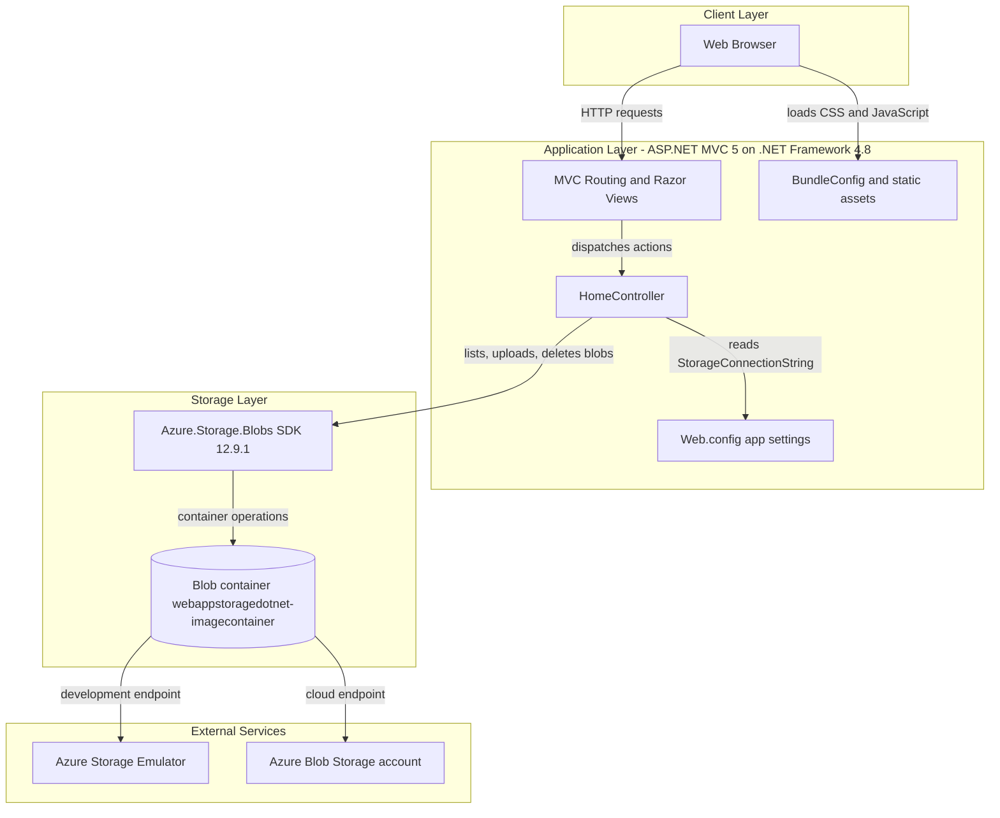
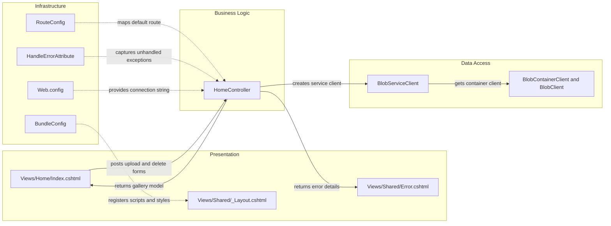

# Architecture Diagram

This document summarizes the high-level architecture and component interactions for the PhotoGallery sample application.

## Application Architecture

### Technology Stack Summary

| Layer | Technology | Version | Purpose |
|---|---|---|---|
| Presentation | ASP.NET MVC + Razor Views | MVC 5.2.3 / Razor 3.2.3 | Server-rendered UI and form handling |
| Application | .NET Framework | 4.8 target | Hosts controller logic and IIS-based web app runtime |
| Client Assets | jQuery + Bootstrap + Respond.js | 1.10.2 / 3.0.0 / 1.2.0 | File upload UI, delete interaction, and styling |
| Storage Access | Azure.Storage.Blobs | 12.9.1 | Connects to Azure Blob Storage using async SDK calls |
| Configuration | Web.config + appSettings | N/A | Stores connection string and ASP.NET runtime settings |

### Data Storage & External Services

The application does not use a relational database. It persists uploaded image files directly to a single Azure Blob Storage container and can target either the local Azure Storage Emulator through `UseDevelopmentStorage=true` or a real Azure Storage account when deployed.

### Key Architectural Decisions

- Uses a single ASP.NET MVC web application rather than separating UI, service, and persistence layers into multiple deployable services.
- Accesses Azure Blob Storage directly from `HomeController` with no repository or domain-service abstraction.
- Relies on server-rendered Razor views and standard MVC routes instead of a separate client-side SPA or API gateway layer.

## Component Relationships

### Component Inventory

| Component | Layer | Type | Responsibility |
|---|---|---|---|
| HomeController | Business Logic | MVC Controller | Handles gallery listing, upload, single delete, and delete-all operations |
| Views/Home/Index.cshtml | Presentation | Razor View | Renders the gallery UI and posts file and delete actions |
| Views/Shared/Error.cshtml | Presentation | Razor View | Displays exception details captured by controller or filter handling |
| Views/Shared/_Layout.cshtml | Presentation | Layout View | Provides the common HTML shell and script/style bundle references |
| RouteConfig | Infrastructure | Routing configuration | Defines the default `{controller}/{action}/{id}` MVC route |
| FilterConfig | Infrastructure | Global filter registration | Adds `HandleErrorAttribute` for exception handling |
| BundleConfig | Infrastructure | Asset bundling configuration | Registers jQuery, Bootstrap, Respond.js, and CSS bundles |
| Web.config | Infrastructure | Application configuration | Stores runtime settings and the blob storage connection string |
| BlobServiceClient | Data Access | Azure SDK client | Connects to the storage account or emulator |
| BlobContainerClient / BlobClient | Data Access | Azure SDK clients | Enumerates blobs and performs upload and delete operations |
