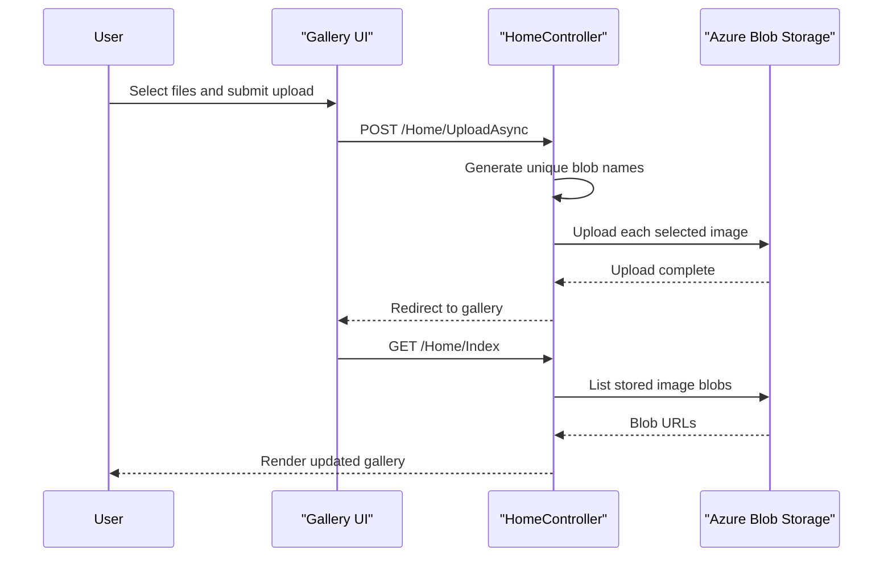

# Core Business Workflows

This application provides a simple photo gallery experience where users can browse, upload, and remove images stored in Azure Blob Storage. Its business behavior is lightweight and centered on maintaining the contents of a single shared gallery container.

## Domain Entities

| Entity | Service / Bounded Context | Description | Key Relationships |
|---|---|---|---|
| Gallery | WebApp-Storage-DotNet / Photo Management | The logical collection of images displayed to end users | Contains many image blobs |
| Image | WebApp-Storage-DotNet / Photo Management | A user-uploaded file stored in Azure Blob Storage and surfaced as a URL in the UI | Belongs to one gallery container |
| Storage Configuration | WebApp-Storage-DotNet / Operations | Runtime information describing which storage account or emulator instance the app should use | Governs where the gallery reads and writes images |

## Service-to-Domain Mapping

| Service | Domain Context | Owned Entities | External Dependencies |
|---|---|---|---|
| WebApp-Storage-DotNet | Photo Management | Gallery, Image, Storage Configuration | Azure Blob Storage or Azure Storage Emulator |

## Primary Workflows

### Workflow 1: Browse the gallery

1. A user opens the root page or `/Home/Index`.
2. The controller reads the configured storage connection string and creates the gallery container if it does not exist.
3. The controller enumerates block blobs in the container and converts them to blob URLs.
4. The Razor view renders the image list and shows delete controls for each image.

Business rules involved:

- Only block blobs are displayed in the gallery listing.
- The container is created lazily on first access so the gallery can start from an empty state.

### Workflow 2: Upload one or more images

1. A user selects one or more files in the browser.
2. The page lists the chosen file names and sizes before submission.
3. The browser posts the selected files to `/Home/UploadAsync`.
4. The controller generates a unique blob name for each file and uploads it to the gallery container.
5. The user is redirected back to the gallery view to see the updated image set.

Business rules involved:

- Each upload is assigned a unique generated blob name to avoid collisions.
- Multiple files can be uploaded in a single submission.

### Workflow 3: Remove images

1. A user either clicks a per-image delete icon or submits the delete-all form.
2. The browser posts to `/Home/DeleteImage` or `/Home/DeleteAll`.
3. The controller deletes the addressed blob or iterates through all block blobs and deletes them.
4. The user is redirected back to the gallery view.

Business rules involved:

- Single delete resolves the blob name from the provided blob URL.
- Delete-all only removes block blobs found in the configured container.

## Cross-Service Data Flows

There are no cross-service business flows because the application is a single web application talking directly to one external storage service. The only external composition is between the browser-facing MVC workflow and Azure Blob Storage, where gallery state is materialized from blob enumeration results.

## Business Workflow Sequence

## Business Rules & Decision Logic

- The application accepts multi-file uploads and processes each selected file independently.
- Uploaded files are renamed using timestamp and GUID-based values to reduce naming collisions.
- Only blobs identified as `Block` blob types are displayed or included in delete-all operations.
- Error handling is coarse-grained: exceptions are surfaced through the error view rather than domain-specific recovery or compensation logic.
- There is no business-level authorization; any caller that can reach the app can invoke browse, upload, and delete workflows.
