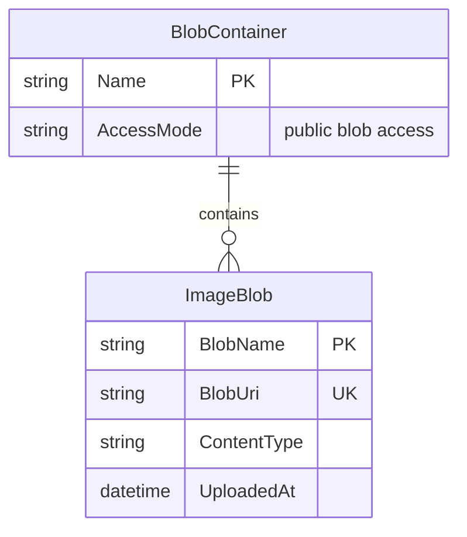

# Data Architecture & Persistence Layer

This application has a very small persistence surface centered on Azure Blob Storage rather than a relational database. It stores uploaded images in a single blob container and does not use an ORM, repositories, or schema migration tooling.

## Database Configuration

| Service/Module | DB Type | Profile | Driver | Connection | Migration Tool |
|---|---|---|---|---|---|
| WebApp-Storage-DotNet | Azure Blob Storage / Storage Emulator | Default | Azure.Storage.Blobs 12.9.1 | `StorageConnectionString` from `Web.config`, defaulting to `UseDevelopmentStorage=true` | None |

## Data Ownership per Service

| Service | Tables Owned | ORM Framework | Caching | Notes |
|---|---|---|---|---|
| WebApp-Storage-DotNet | Blob container `webappstoragedotnet-imagecontainer` and its image blobs | None; direct Azure SDK access | None | Single application owns all stored image objects |

## Entity Model

> Note: The repository does not define ORM entities or repository classes. The diagram models the logical persistence structure inferred from direct blob container usage in `HomeController`.

## Key Repository Methods

| Service | Repository | Notable Methods | Purpose |
|---|---|---|---|
| WebApp-Storage-DotNet | No repository abstraction; `HomeController` directly uses `BlobContainerClient` | `GetBlobs()`, `UploadAsync(...)`, `DeleteIfExistsAsync()`, `DeleteBlobIfExistsAsync(...)` | Lists gallery items, uploads files, and removes one or all blobs |

## Caching Strategy

No caching layer is configured. Each gallery request recreates or reuses the blob container client and reads the current blob list directly from storage, while upload and delete operations immediately act on the backing container.

## Data Ownership Boundaries

The application is a single deployable unit with a single logical data store. There are no cross-service ownership boundaries, no shared relational schemas, and no CQRS-style read/write separation. All persistence operations originate inside `HomeController`, which acts as both orchestration layer and storage access layer.

### Data Classification & Sensitivity

| Entity | Sensitive Fields | Classification (PII/PHI/PCI/None) | Controls in Place |
|---|---|---|---|
| BlobContainer | None detected in code | None | Access mode is set to public blob access for stored images |
| ImageBlob | Blob binary content is user-supplied and deployment-dependent; no fixed sensitive metadata in code | None inferred from repository | No masking, field-level controls, or encryption settings are configured in application code |

No PII, PHI, or PCI-specific entity fields are defined in the repository. Uploaded file contents may still be sensitive depending on how the sample is used in a deployed environment.
