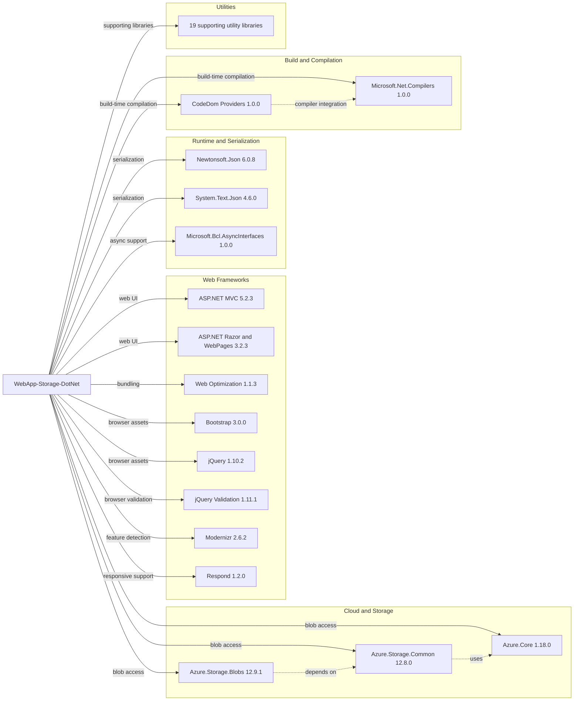

# Dependency Map

This document summarizes the declared external dependencies for the PhotoGallery sample. The project declares 34 NuGet packages, with most dependencies concentrated in the ASP.NET MVC web stack and supporting utility libraries.

## Dependencies

### Dependency Summary

| Category | Count | Key Libraries | Notes |
|---|---|---|---|
| Web Frameworks | 8 | ASP.NET MVC 5.2.3, Razor 3.2.3, Bootstrap 3.0.0 | Legacy System.Web MVC stack with bundled client-side libraries |
| Cloud and Storage | 3 | Azure.Storage.Blobs 12.9.1, Azure.Core 1.18.0 | Modern Azure SDK is used directly from the MVC app |
| Runtime and Serialization | 3 | Newtonsoft.Json 6.0.8, System.Text.Json 4.6.0 | Mixed serialization/runtime support libraries |
| Build and Compilation | 2 | Microsoft.CodeDom.Providers.DotNetCompilerPlatform 1.0.0, Microsoft.Net.Compilers 1.0.0 | Legacy compiler support for ASP.NET on .NET Framework |
| Utilities | 18 | Antlr, WebGrease, System.Memory, System.Buffers | Supporting packages for optimization, parsing, and compatibility |

### Version & Compatibility Risks

The application targets .NET Framework 4.8 and depends on the legacy System.Web MVC stack, which has no direct in-place path to modern ASP.NET Core hosting. Several client-side and utility packages are significantly dated, including jQuery 1.10.2, Bootstrap 3.0.0, Modernizr 2.6.2, and Newtonsoft.Json 6.0.8, which may create security and compatibility work during modernization.

### Notable Observations

- The app mixes a modern Azure Blob Storage SDK with a much older ASP.NET MVC and front-end package baseline.
- `Microsoft.Net.Compilers` and `Microsoft.CodeDom.Providers.DotNetCompilerPlatform` are build-time dependencies tied to the legacy web application project model.
- No database, messaging, caching, or observability packages are declared; the app is focused on direct file storage only.
- No dedicated security framework package is present, which aligns with the codebase exposing unauthenticated public endpoints.

## Test Dependencies

| Framework | Version | Notes |
|---|---|---|

Total test-scope dependencies: 0

No test dependencies detected. The repository does not contain a separate automated test project or test-specific package declarations.
