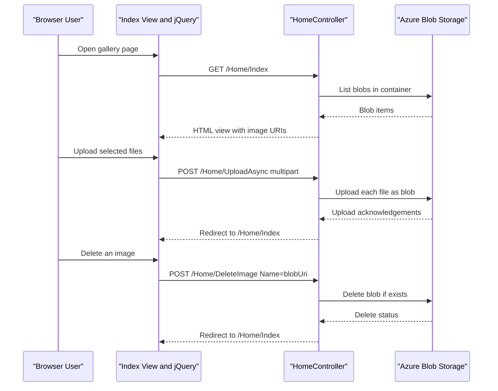

# API & Service Communication Contracts

The application exposes a small MVC endpoint surface centered on gallery operations. Communication is synchronous from browser to server, then synchronous server-to-Azure Blob Storage SDK calls.

## Service Catalog

| Service | Port | Category | Purpose |
|---|---:|---|---|
| WebApp-Storage-DotNet | 20050 (IIS Express default) | API Layer | Hosts MVC actions and renders the photo gallery UI |
| Azure Blob Storage | 443 | Infrastructure | Stores and serves uploaded image blobs |

## API Endpoints Inventory

| Service | Method | Path | Request Type | Response Type |
|---|---|---|---|---|
| WebApp-Storage-DotNet | GET | /Home/Index (and / via default route) | None | HTML view with `List<Uri>` model |
| WebApp-Storage-DotNet | POST | /Home/UploadAsync | Multipart form files (`Request.Files`) | Redirect to Index |
| WebApp-Storage-DotNet | POST | /Home/DeleteImage | Form value `Name` (blob URL string) | Redirect to Index |
| WebApp-Storage-DotNet | POST | /Home/DeleteAll | No body fields required | Redirect to Index |

## Management & Observability Endpoints

| Service | Endpoint | Custom Metrics (if any) |
|---|---|---|
| WebApp-Storage-DotNet | None explicitly configured | None detected |

## DTOs & Contracts

The application uses MVC primitives instead of explicit API DTO classes. Request contracts are primarily multipart file uploads and form values (`Name` for delete). Response contracts are server-rendered Razor views with a `List<Uri>` model for image listing. No OpenAPI/Swagger specification, protobuf schema, or GraphQL schema was found.

## Communication Patterns

Communication is synchronous and request-response oriented. Browser interactions submit forms or jQuery POST calls to MVC actions; the controller then performs synchronous orchestration of Azure Blob SDK operations with async APIs. No message queue or event-driven asynchronous communication is configured. No explicit retry, timeout, or circuit-breaker policy is present in application code. Service discovery is not used because the system is a single web app plus external Azure Blob endpoint. Security posture at API level is minimal: no explicit authentication, authorization attributes, or API-specific TLS termination settings are defined in code.

## Service Technology Matrix

| Service | Web | Data Access | Discovery | Gateway | Actuator | Cache | Metrics |
|---|---|---|---|---|---|---|---|
| WebApp-Storage-DotNet | ASP.NET MVC 5 | Azure.Storage.Blobs SDK | None | None | None | None | None |
| Azure Blob Storage | Managed Blob service endpoint | Native blob storage API | N/A | N/A | N/A | N/A | N/A |

## Service Communication Sequence

