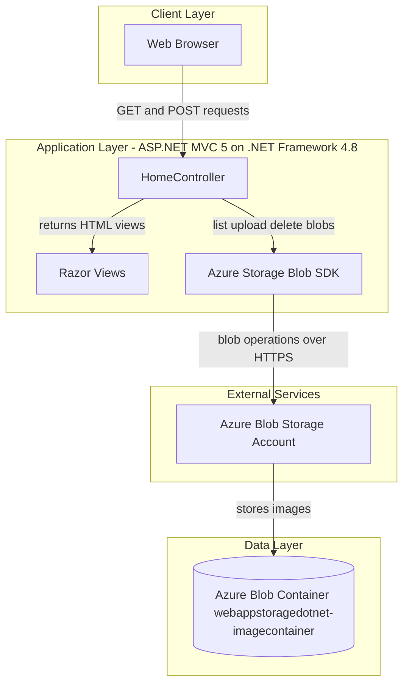
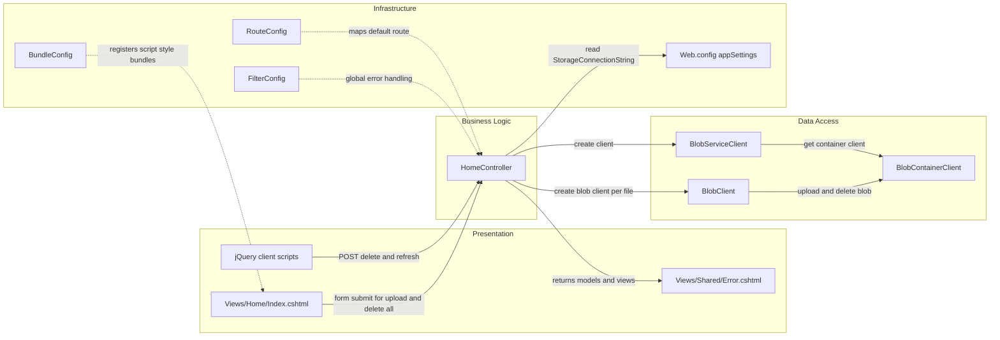

# Architecture Diagram

This application is a single ASP.NET MVC web app that serves a photo gallery UI and uses Azure Blob Storage as its backing store for uploaded images.

## Application Architecture

### Technology Stack Summary

| Layer | Technology | Version | Purpose |
|---|---|---|---|
| Presentation | ASP.NET MVC + Razor | MVC 5.2.3 | Server rendered web UI for image gallery |
| Application | .NET Framework | 4.8 | Web app runtime and request handling |
| Data Access | Azure.Storage.Blobs SDK | 12.9.1 | Programmatic blob container and blob operations |
| Frontend Assets | jQuery + Bootstrap | 1.10.2 and 3.0.0 | Client interactivity and UI styling |

### Data Storage & External Services

The application stores image binaries in an Azure Blob Storage container. It uses the `StorageConnectionString` app setting to connect either to the storage emulator for local development or a real Azure Storage account in deployed environments.

### Key Architectural Decisions

- Uses a single MVC controller (`HomeController`) to handle all gallery operations.
- Stores unstructured files in blob storage instead of a relational database.
- Uses asynchronous blob SDK methods for upload and delete operations.

## Component Relationships

### Component Inventory

| Component | Layer | Type | Responsibility |
|---|---|---|---|
| HomeController | Business Logic | MVC Controller | Lists blobs, uploads files, deletes single or all files |
| Index.cshtml | Presentation | Razor View | Displays gallery and upload/delete controls |
| Error.cshtml | Presentation | Razor View | Displays error details from controller exception handling |
| RouteConfig | Infrastructure | Route Configuration | Configures default MVC route mapping |
| FilterConfig | Infrastructure | Global Filter Registration | Registers global error handling filter |
| BundleConfig | Infrastructure | Asset Bundling Configuration | Registers script and stylesheet bundles |
| BlobServiceClient | Data Access | SDK Client | Connects to Azure Blob Storage account |
| BlobContainerClient | Data Access | SDK Client | Represents and manages image container |
| BlobClient | Data Access | SDK Client | Uploads/deletes individual image blobs |
