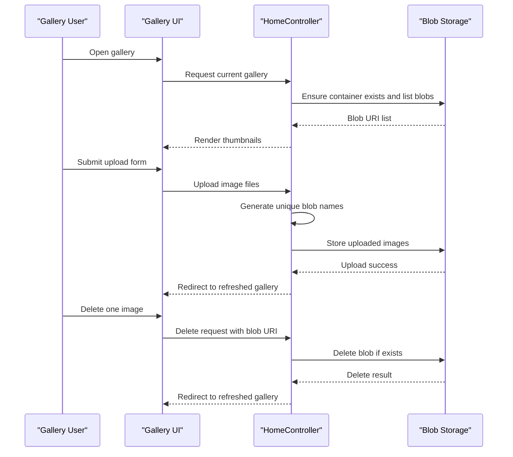

# Core Business Workflows

The application supports a photo gallery workflow where users upload, view, and remove images backed by Azure Blob Storage. The business process is focused on lightweight media management rather than complex domain transactions.

## Domain Entities

| Entity | Service / Bounded Context | Description | Key Relationships |
|---|---|---|---|
| Gallery Session | WebApp-Storage-DotNet / Gallery Management | User interaction scope for browsing and modifying images | Initiates upload and delete actions |
| Image Blob | WebApp-Storage-DotNet / Media Storage | Stored photo artifact represented by blob URI and blob name | Belongs to blob container |
| Blob Container | WebApp-Storage-DotNet / Media Storage | Logical collection of all gallery images | Contains many image blobs |

## Service-to-Domain Mapping

| Service | Domain Context | Owned Entities | External Dependencies |
|---|---|---|---|
| WebApp-Storage-DotNet | Gallery Management | Gallery Session, Image Blob metadata handling | Azure Blob Storage |

## Primary Workflows

### Workflow 1: Browse Gallery

1. User opens gallery page.
2. Controller initializes blob container access and ensures container exists.
3. Controller fetches blob list and maps blob names to URIs.
4. View renders image thumbnails and delete actions.

### Workflow 2: Upload Images

1. User selects one or more files and submits upload form.
2. Controller validates that files exist in request payload.
3. For each file, controller generates a unique blob name.
4. Blob upload is executed and user is redirected back to gallery view.

### Workflow 3: Delete Images

1. User triggers delete for a single image or all images.
2. Controller resolves target blob name(s).
3. Blob delete operation executes with exists check.
4. User is redirected to updated gallery view.

## Cross-Service Data Flows

There is one application service and one external storage dependency. Data flow is direct: the MVC controller reads and writes blob objects through Azure Blob Storage SDK calls, and then returns updated gallery state to the browser. No service aggregation across multiple backend services is present.

## Business Workflow Sequence

## Business Rules & Decision Logic

- Uploaded files are processed only when request file count is greater than zero.
- Blob names are randomized using timestamp plus GUID to avoid naming collisions.
- Delete actions tolerate missing blobs through "delete if exists" behavior.
- Error handling captures exceptions and routes users to an error view with details.
