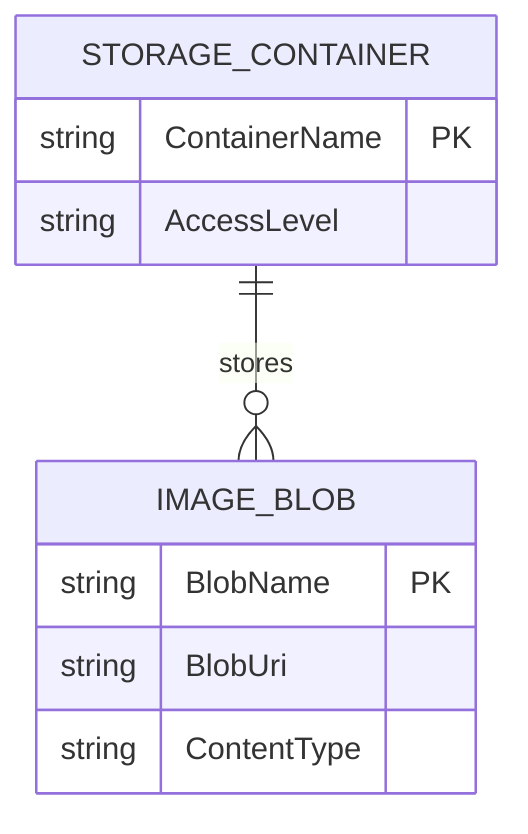

# Data Architecture & Persistence Layer

The data layer is centered on Azure Blob Storage, with no relational database or ORM entity model. Persistence is file-oriented where uploaded images are stored and retrieved as blobs from a single container.

## Database Configuration

| Service/Module | DB Type | Profile | Driver | Connection | Migration Tool |
|---|---|---|---|---|---|
| WebApp-Storage-DotNet | Azure Blob Storage (object store) | Default | Azure.Storage.Blobs SDK | `StorageConnectionString` app setting | None |

## Data Ownership per Service

| Service | Tables Owned | ORM Framework | Caching | Notes |
|---|---|---|---|---|
| WebApp-Storage-DotNet | None (blob objects only) | None | None | Owns blob naming and container interaction logic |

## Entity Model

## Key Repository Methods

| Service | Repository | Notable Methods | Purpose |
|---|---|---|---|
| WebApp-Storage-DotNet | BlobContainerClient usage in `HomeController` | `GetBlobs()`, `GetBlobClient(name)`, `CreateIfNotExistsAsync()` | List and initialize blob container |
| WebApp-Storage-DotNet | BlobClient usage in `HomeController` | `UploadAsync(filePath)`, `DeleteIfExistsAsync()` | Upload and delete individual image blobs |
| WebApp-Storage-DotNet | BlobContainerClient usage in `HomeController` | `DeleteBlobIfExistsAsync(blobName)` | Bulk delete all images in container |

## Caching Strategy

No explicit caching layer was detected. The application directly queries the blob container for each gallery request and performs write operations directly against the blob service.

## Data Ownership Boundaries

Data ownership is simple and centralized: the web application owns naming and lifecycle of image blobs inside one container. There are no separate services or independent data stores, so no cross-service data access pattern or CQRS split is present.

### Data Classification & Sensitivity

| Entity | Sensitive Fields | Classification (PII/PHI/PCI/None) | Controls in Place |
|---|---|---|---|
| IMAGE_BLOB | Image file contents may contain user-provided visual data | PII (potential, content-dependent) | No explicit masking or field-level controls in app code |
| STORAGE_CONTAINER | None | None | Container-level access configured via storage account and connection string |
