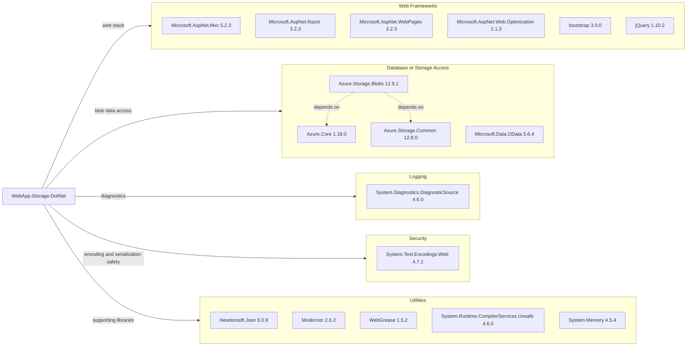

# Dependency Map

This ASP.NET MVC application declares 34 NuGet dependencies focused on web UI, Azure Blob Storage access, and supporting runtime libraries.

## Dependencies

### Dependency Summary

| Category | Count | Key Libraries | Notes |
|---|---:|---|---|
| Web Frameworks | 10 | Microsoft.AspNet.Mvc, Razor, WebPages, jQuery, bootstrap | Legacy ASP.NET MVC 5 stack on .NET Framework |
| Database / ORM | 0 | None | No relational ORM package is declared |
| Storage / Data Access | 6 | Azure.Storage.Blobs, Azure.Core, Azure.Storage.Common | Blob-only persistence through Azure Storage SDK |
| Messaging | 0 | None | No messaging client libraries detected |
| Caching | 0 | None | No cache package declared |
| Logging | 1 | System.Diagnostics.DiagnosticSource | Basic diagnostics dependency only |
| Security | 2 | System.Text.Encodings.Web, Microsoft.Bcl.AsyncInterfaces | Minimal foundational security/runtime libraries |
| Utilities | 15 | Newtonsoft.Json, Modernizr, WebGrease, System.Memory | Mix of legacy and compatibility libraries |

### Version & Compatibility Risks

The application targets .NET Framework 4.8 with ASP.NET MVC 5-era packages and several older dependencies (for example Newtonsoft.Json 6.0.8 and jQuery 1.10.2). This stack is functional but dated, and modernization to supported current frameworks will likely require package and API updates.

### Notable Observations

- Dependency management uses `packages.config`, which is legacy for modern .NET migration workflows.
- No test-scoped packages are declared in the project package manifest.
- Azure Blob dependencies are present and appear aligned around the v12 SDK family.
- Several compatibility packages (`System.*` backports) indicate bridging newer libraries into .NET Framework.

## Test Dependencies

| Framework | Version | Notes |
|---|---|---|
| None detected | N/A | No test package references found |

Total test-scope dependencies: 0

No test dependencies detected.
