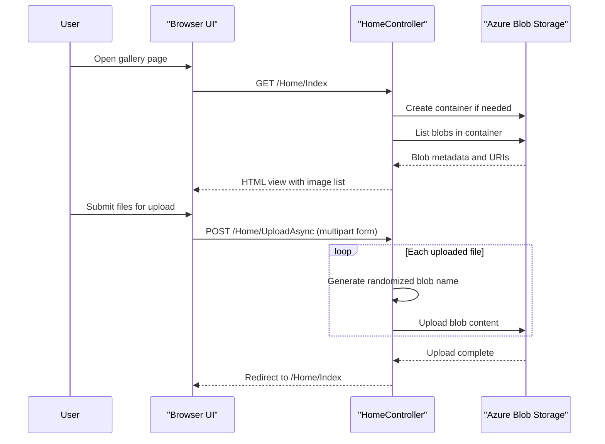

# API & Service Communication Contracts

The application exposes a very small HTTP surface through a single MVC controller: one page for viewing the gallery and three form-post actions for upload and deletion. Communication is synchronous from browser to web app, while storage operations use the Azure Blob Storage SDK asynchronously inside the server process.

## Service Catalog

| Service | Port | Category | Purpose |
|---|---:|---|---|
| WebApp-Storage-DotNet | 20050 (IIS Express) | API Layer | Hosts the browser-facing photo gallery and mediates all blob storage operations |

## API Endpoints Inventory

| Service | Method | Path | Request Type | Response Type |
|---|---|---|---|---|
| WebApp-Storage-DotNet | GET | `/` or `/Home/Index` | None | Razor view with `List<Uri>` gallery model |
| WebApp-Storage-DotNet | POST | `/Home/UploadAsync` | `multipart/form-data` via `Request.Files` | Redirect to `Index` |
| WebApp-Storage-DotNet | POST | `/Home/DeleteImage` | Form field `name` containing blob URI string | Redirect to `Index` |
| WebApp-Storage-DotNet | POST | `/Home/DeleteAll` | None | Redirect to `Index` |

## Management & Observability Endpoints

| Service | Endpoint | Custom Metrics (if any) |
|---|---|---|
| WebApp-Storage-DotNet | None detected | None detected |

## DTOs & Contracts

The repository does not define explicit request or response DTO classes. The gallery page receives a `List<Uri>` model from `HomeController.Index`, uploads are accepted directly from `HttpFileCollectionBase`, and delete operations use a single string parameter containing the selected blob URI. No OpenAPI, Swagger, protobuf, or GraphQL contracts are present. Serialization behavior is mostly implicit because the application renders server-side HTML rather than JSON APIs.

## Communication Patterns

All communication is synchronous at the HTTP contract level: a browser calls MVC routes and receives HTML or redirects. Inside the application, blob operations use asynchronous Azure SDK methods such as `CreateIfNotExistsAsync`, `UploadAsync`, `DeleteIfExistsAsync`, and `DeleteBlobIfExistsAsync`, but there is no message broker, eventing, service discovery, API gateway, or downstream service fan-out. No retry, timeout, circuit-breaker, or bulkhead policy is configured in source. The API surface is effectively public: the application does not configure authentication, authorization, or transport-security enforcement in the repository, so all endpoints are publicly reachable subject to the hosting environment.

## Service Technology Matrix

| Service | Web | Data Access | Discovery | Gateway | Actuator | Cache | Metrics |
|---|---|---|---|---|---|---|---|
| WebApp-Storage-DotNet | ASP.NET MVC 5 + Razor | Azure Blob Storage SDK | None | None | None | None | None |

## Service Communication Sequence

