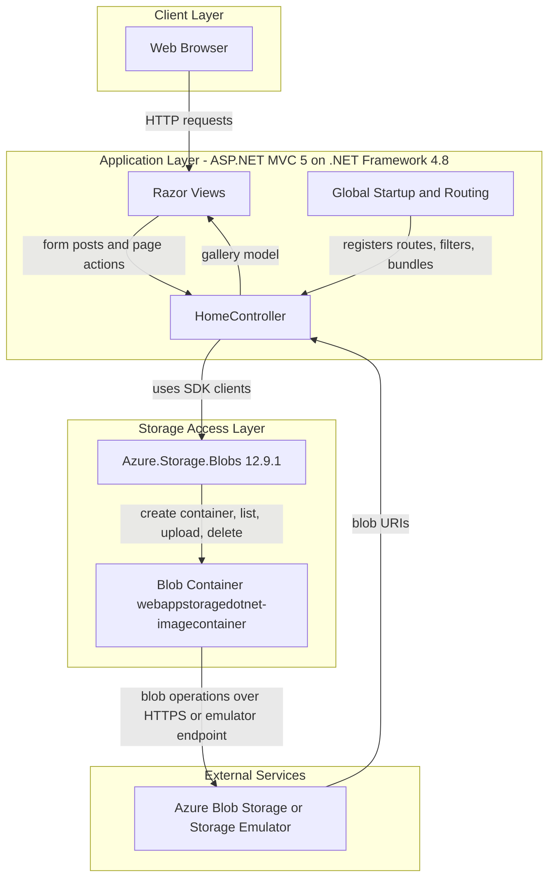
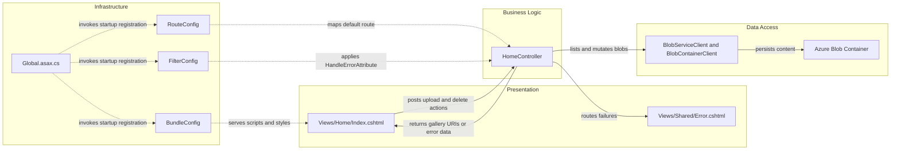

# Architecture Diagram

This repository contains a single ASP.NET MVC 5 web application that renders a browser-based photo gallery and stores image content in Azure Blob Storage. The application is a classic layered web app with presentation, controller logic, and cloud storage integration in one deployable unit.

## Application Architecture

### Technology Stack Summary

| Layer | Technology | Version | Purpose |
|---|---|---:|---|
| Presentation | ASP.NET MVC + Razor | 5.2.3 / 3.2.3 | Serves the gallery UI and handles form posts |
| Client UI | jQuery + Bootstrap | 1.10.2 / 3.0.0 | Client-side upload list rendering and page styling |
| Application Logic | .NET Framework | 4.8 | Hosts controller actions and application startup |
| Storage Access | Azure.Storage.Blobs | 12.9.1 | Connects the app to Azure Blob Storage |
| Hosting | IIS Express settings in project | Dev port 20050 | Local development hosting profile |

### Data Storage & External Services

The application does not use a relational database or message broker. Its only external dependency is Azure Blob Storage, accessed through a single blob container for listing, uploading, and deleting image files; local development defaults to the Azure Storage emulator via `UseDevelopmentStorage=true`.

### Key Architectural Decisions

- Uses a single deployable ASP.NET MVC application rather than splitting UI and backend APIs into separate services.
- Performs storage operations directly inside `HomeController` instead of introducing a repository or service abstraction.
- Relies on Azure Blob Storage as the sole persistence mechanism for user-visible gallery content.

## Component Relationships

### Component Inventory

| Component | Layer | Type | Responsibility |
|---|---|---|---|
| `Views/Home/Index.cshtml` | Presentation | Razor View | Renders the gallery, upload form, delete actions, and client-side JavaScript |
| `Views/Shared/Error.cshtml` | Presentation | Razor View | Displays exceptions captured by controller error handling |
| `HomeController` | Business Logic | MVC Controller | Handles gallery listing, upload, delete-one, and delete-all workflows |
| `BlobServiceClient` / `BlobContainerClient` | Data Access | Azure SDK Client | Connects to the storage account and issues blob operations |
| `Global.asax.cs` | Infrastructure | Application Startup | Registers routes, filters, and bundles when the app starts |
| `RouteConfig` | Infrastructure | Route Registration | Maps the default `{controller}/{action}/{id}` route |
| `FilterConfig` | Infrastructure | Filter Registration | Adds the global `HandleErrorAttribute` |
| `BundleConfig` | Infrastructure | Asset Registration | Defines script and style bundles for jQuery, Bootstrap, and site CSS |
