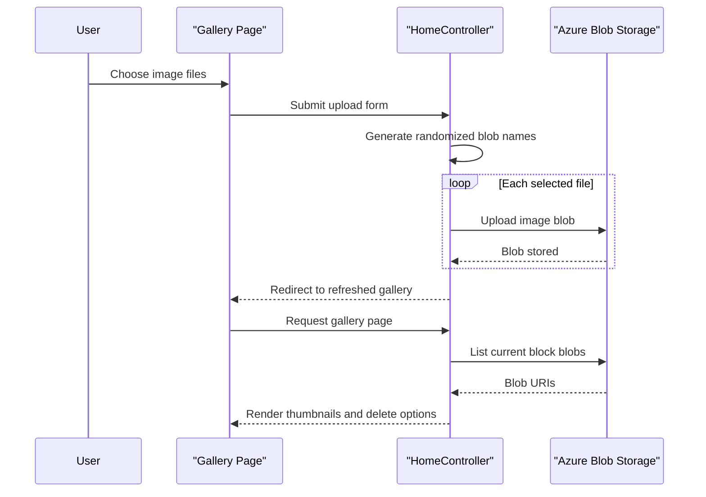

# Core Business Workflows

This application lets a user browse, upload, and delete photos stored in a single Azure Blob Storage container. The business logic is intentionally simple, with the web application acting as both the user-facing workflow engine and the integration point to storage.

## Domain Entities

| Entity | Service / Bounded Context | Description | Key Relationships |
|---|---|---|---|
| Image Asset | WebApp-Storage-DotNet / Gallery Management | A user-visible uploaded photo stored as a blob | Belongs to the gallery container and is rendered on the gallery page |
| Gallery View | WebApp-Storage-DotNet / Gallery Management | The collection of image URIs shown to the user | Aggregates all current image assets |
| Blob Container | WebApp-Storage-DotNet / Storage Integration | Logical storage boundary for all uploaded photos | Owns the image assets |
| Delete Request | WebApp-Storage-DotNet / Gallery Management | User intent to remove one image or all images | Targets one image asset or the full container contents |

## Service-to-Domain Mapping

| Service | Domain Context | Owned Entities | External Dependencies |
|---|---|---|---|
| WebApp-Storage-DotNet | Gallery Management | Gallery View, Image Asset, Delete Request | Azure Blob Storage |

## Primary Workflows

### Workflow 1: Browse the gallery

1. The user opens the home page.
2. `HomeController.Index` builds a `BlobServiceClient` from `StorageConnectionString`.
3. The application creates the blob container if it does not already exist.
4. The controller enumerates block blobs, converts them to URIs, and returns them to the Razor view.
5. The browser renders thumbnails and delete actions for each image.

Business rules involved:

- Only block blobs are displayed in the gallery.
- The container is created on demand, so first-time use does not require pre-provisioning in code.

### Workflow 2: Upload images

1. The user selects one or more files in the browser.
2. JavaScript updates the page to show the chosen file names and sizes.
3. The browser submits a multipart form to `UploadAsync`.
4. For each file, the controller generates a randomized blob name and uploads the content.
5. The user is redirected back to the gallery and sees the refreshed list of images.

Business rules involved:

- Each uploaded file receives a randomized name to avoid collisions.
- Multiple files can be uploaded in one request.

### Workflow 3: Delete one image or all images

1. The user either clicks the delete icon for one image or submits the Delete All form.
2. For single delete, the controller extracts the blob filename from the image URI.
3. The controller issues delete operations against storage.
4. The user is redirected back to the gallery to confirm the updated state.

Business rules involved:

- Single delete targets the blob represented by the selected URI.
- Delete All removes every block blob currently present in the container.

## Cross-Service Data Flows

There is no multi-service choreography in this repository; all business workflows flow through one web application and one external storage service. Data composition is straightforward: the browser requests HTML, the server pulls blob metadata from Azure Blob Storage, and the view renders those URIs back to the user. If storage is unavailable or the connection string is invalid, the application degrades to its error view rather than returning partial business data.

## Business Workflow Sequence

## Business Rules & Decision Logic

- The application creates the storage container lazily during gallery access, ensuring the workflow can initialize itself on first use.
- Gallery rendering includes only blobs identified as `Block` blobs.
- Upload logic randomizes blob names using timestamp ticks plus a GUID, reducing collision risk.
- Delete-one logic derives the blob identifier from the image URI rather than storing a separate domain key.
- Error handling is centralized in controller `try/catch` blocks and the MVC error view; there is no retry or compensating transaction logic.
- No business-level authorization rules are implemented, so any user who can reach the site can invoke upload and delete workflows.
