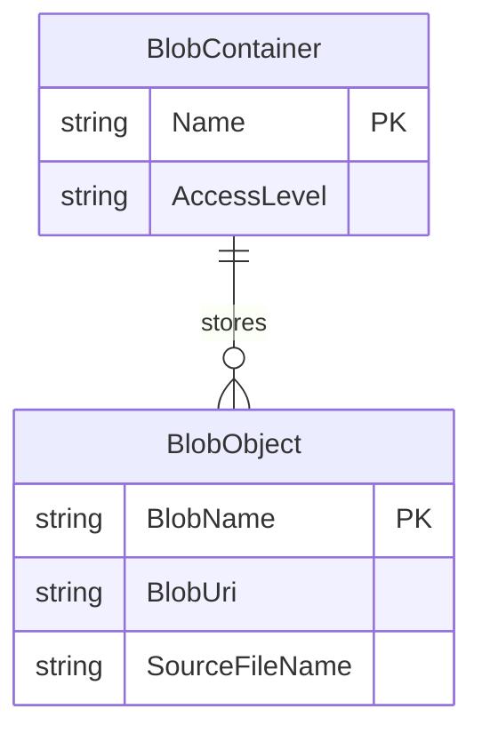

# Data Architecture & Persistence Layer

The application has a minimal persistence layer centered on Azure Blob Storage rather than a traditional database. There are no ORM entities or repository interfaces in source; the controller talks directly to a blob container and treats stored image files as the application’s persistent records.

## Database Configuration

| Service/Module | DB Type | Profile | Driver | Connection | Migration Tool |
|---|---|---|---|---|---|
| WebApp-Storage-DotNet | Azure Blob Storage | Default / local development | `Azure.Storage.Blobs` | `StorageConnectionString` from `Web.config` (defaults to `UseDevelopmentStorage=true`) | None |
| WebApp-Storage-DotNet | Azure Blob Storage | Cloud deployment | `Azure.Storage.Blobs` | `StorageConnectionString` replaced with a real storage account connection string | None |

## Data Ownership per Service

| Service | Tables Owned | ORM Framework | Caching | Notes |
|---|---|---|---|---|
| WebApp-Storage-DotNet | Logical blob container `webappstoragedotnet-imagecontainer` and its image blobs | None | None | The app stores and retrieves image files directly through Azure Blob Storage SDK clients |

## Entity Model

> Note: Some entities or relationships could not be fully identified because persistence is implemented through direct blob SDK calls rather than explicit data model classes.

## Key Repository Methods

| Service | Repository | Notable Methods | Purpose |
|---|---|---|---|
| WebApp-Storage-DotNet | Direct `HomeController` + Azure SDK usage | `GetBlobContainerClient`, `GetBlobs`, `UploadAsync`, `DeleteIfExistsAsync`, `DeleteBlobIfExistsAsync` | Implements all persistence operations without a repository abstraction |

## Caching Strategy

No cache provider, cache annotations, or cache-aside pattern is configured in the repository. Every gallery load enumerates blobs directly from storage, and all write operations go straight to the container.

## Data Ownership Boundaries

The application is a single service with a single logical data store, so there are no cross-service ownership boundaries or CQRS patterns. All reads and writes target one blob container, and the same MVC controller is both the source of truth for workflow orchestration and the caller of storage operations.

### Data Classification & Sensitivity

| Entity | Sensitive Fields | Classification (PII/PHI/PCI/None) | Controls in Place |
|---|---|---|---|
| BlobObject | Blob name, uploaded image content | None | No application-level masking or encryption configuration is defined in the repository; storage protection relies on the Azure Storage account configuration outside source control |
| BlobContainer | Container name | None | Public blob access is enabled in code via `CreateIfNotExistsAsync(PublicAccessType.Blob)` |
