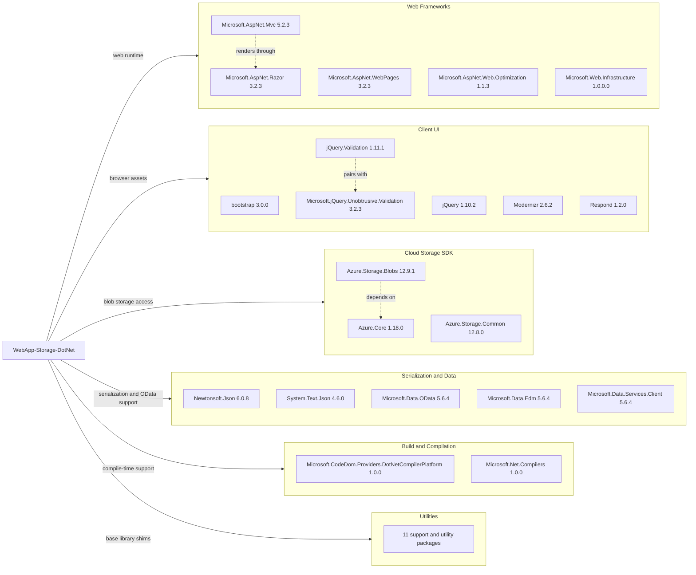

# Dependency Map

This project declares 34 NuGet packages in a single classic ASP.NET MVC application. Most dependencies fall into web UI, ASP.NET MVC runtime support, and Azure storage client libraries, with no dedicated test-only dependency set.

## Dependencies

### Dependency Summary

| Category | Count | Key Libraries | Notes |
|---|---:|---|---|
| Web Frameworks | 5 | ASP.NET MVC, Razor, WebPages, Web.Optimization | Classic ASP.NET MVC 5 stack on .NET Framework |
| Client UI | 6 | bootstrap, jQuery, jQuery.Validation | Legacy browser-side asset set bundled with the web app |
| Cloud Storage SDK | 3 | Azure.Storage.Blobs, Azure.Core | Enables all blob listing, upload, and delete operations |
| Serialization and Data | 5 | Newtonsoft.Json, System.Text.Json, Microsoft.Data.OData | Mixed JSON and older OData-related dependencies |
| Build and Compilation | 2 | CodeDom provider, Microsoft.Net.Compilers | Legacy compilation support for classic web projects |
| Utilities | 13 | System.* shims, WebGrease, Antlr | Compatibility and helper libraries required by the older stack |

### Version & Compatibility Risks

The dependency set is anchored on ASP.NET MVC 5 and .NET Framework-era packages, which makes direct modernization to current .NET versions non-trivial. Several browser-side packages are very old, and the upgrade assessment also flags security concerns around `Azure.Storage.Blobs`, `bootstrap`, `jQuery`, and `jQuery.Validation`, plus incompatibility for `Microsoft.AspNet.Web.Optimization`.

### Notable Observations

- The project mixes both `Newtonsoft.Json` and `System.Text.Json`, which can complicate serialization behavior during upgrade work.
- OData-related packages (`Microsoft.Data.*`, `System.Spatial`) are declared even though the repository’s current source code is very small; these deserve review during modernization.
- `Microsoft.Net.Compilers` and the CodeDom provider reflect an older build model that aligns with the classic `.csproj` format and Visual Studio web tooling requirements.
- No logging, messaging, caching, or observability frameworks are declared as first-class dependencies.

## Test Dependencies

| Framework | Version | Notes |
|---|---|---|
| None detected | - | `packages.config` does not declare xUnit, NUnit, MSTest, Moq, or similar test libraries |

Total test-scope dependencies: 0

No test dependencies were detected, which matches the repository’s single-project solution structure and the absence of a dedicated automated test project.
