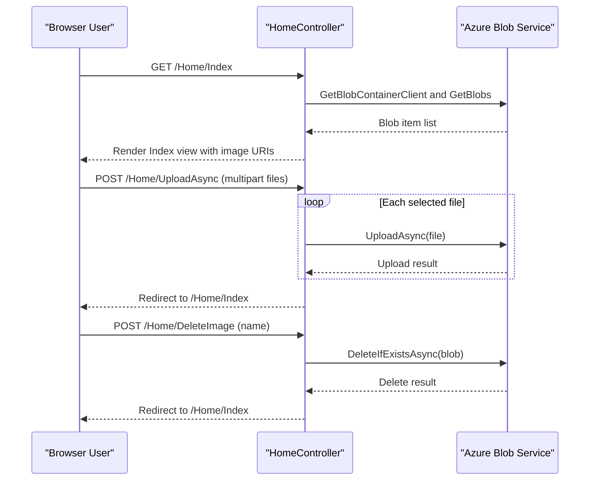

# API & Service Communication Contracts

The application exposes a small MVC endpoint surface for listing, uploading, and deleting gallery images. Communication is primarily synchronous HTTP from browser to server and synchronous SDK calls from server to Azure Blob Storage.

## Service Catalog

| Service | Port | Category | Purpose |
|---|---|---|---|
| WebApp-Storage-DotNet | 20050 (IIS Express default in project settings) | API Layer | Serves photo gallery UI and handles blob operations |
| Azure Blob Storage | 443 (cloud) or emulator endpoint | Infrastructure | Stores image objects and serves blob URLs |

## API Endpoints Inventory

| Service | Method | Path | Request Type | Response Type |
|---|---|---|---|---|
| HomeController | GET | `/Home/Index` (default route also `/`) | No body; optional route params | Razor view with `List<Uri>` model |
| HomeController | POST | `/Home/UploadAsync` | Multipart form-data (`Request.Files`) | Redirect to `Index` |
| HomeController | POST | `/Home/DeleteImage` | Form field `name` containing blob URI string | Redirect to `Index` |
| HomeController | POST | `/Home/DeleteAll` | No body | Redirect to `Index` |

## Management & Observability Endpoints

| Service | Endpoint | Custom Metrics (if any) |
|---|---|---|
| WebApp-Storage-DotNet | None explicitly configured (no health or metrics endpoint) | None detected |

## DTOs & Contracts

The API contract is lightweight and MVC-form based rather than JSON API-first. Request contracts are implicit: uploaded files arrive via `HttpFileCollectionBase` and image deletion uses a `name` string parameter containing the blob URL. The primary response contract for the gallery page is a `List<Uri>` passed to `Index.cshtml`. No OpenAPI/Swagger, protobuf, or GraphQL schema was detected.

## Communication Patterns

Browser calls MVC endpoints synchronously over HTTP, and controller actions issue synchronous-style SDK calls to Azure Blob Storage (implemented as async methods with `await`). No asynchronous messaging, queue-based integration, circuit breaker policy, retry framework, or service discovery mechanism was found. Startup dependency is minimal: app configuration must include a valid `StorageConnectionString` for API availability. Security posture is limited: no explicit authentication, authorization, or enforced TLS policy is configured in application code.

## Service Technology Matrix

| Service | Web | Data Access | Discovery | Gateway | Actuator | Cache | Metrics |
|---|---|---|---|---|---|---|---|
| WebApp-Storage-DotNet | ASP.NET MVC 5 | Azure.Storage.Blobs SDK | None | None | No | No | No |

## Service Communication Sequence

