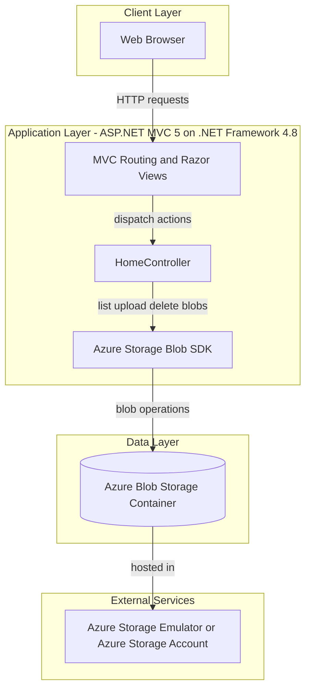
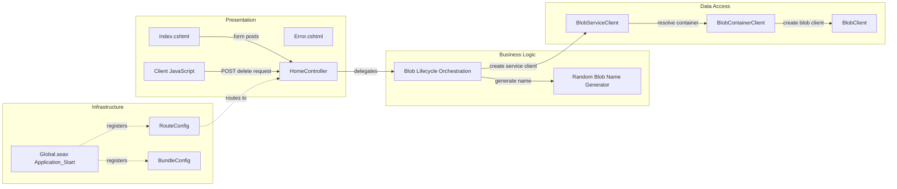

# Architecture Diagram

This application is a single-service ASP.NET MVC web app that serves a photo gallery UI and stores image files in Azure Blob Storage. The architecture is presentation-heavy with direct controller-to-storage interactions.

## Application Architecture

### Technology Stack Summary

| Layer | Technology | Version | Purpose |
|---|---|---|---|
| Presentation | ASP.NET MVC | 5.2.3 | Server-rendered web UI and routing |
| Presentation | Razor Views | 3.2.3 | HTML view rendering |
| Application | .NET Framework | 4.8 target | Runtime platform |
| Data Access | Azure.Storage.Blobs | 12.9.1 | Blob container and object operations |
| Front-end Assets | jQuery + Bootstrap | 1.10.2 / 3.0.0 | Client-side interactions and styling |

### Data Storage & External Services

The application persists uploaded image binaries in a single Azure Blob Storage container (`webappstoragedotnet-imagecontainer`) and does not use a relational database. In development, configuration defaults to `UseDevelopmentStorage=true`, with production expected to point to an Azure Storage account.

### Key Architectural Decisions

- Uses an ASP.NET MVC monolith with one main controller handling both UI and storage orchestration.
- Uses direct Azure Blob SDK calls from controller actions instead of a repository/service abstraction.
- Uses asynchronous controller actions for blob I/O operations (list, upload, delete).

## Component Relationships

### Component Inventory

| Component | Layer | Type | Responsibility |
|---|---|---|---|
| HomeController | Presentation | MVC Controller | Handles gallery page rendering and blob operations |
| Index.cshtml | Presentation | Razor View | Displays images, upload form, and delete actions |
| Client JavaScript in Index.cshtml | Presentation | Script | Calls delete endpoint and updates upload UI |
| BlobServiceClient | Data Access | Azure SDK client | Entry point for storage account operations |
| BlobContainerClient | Data Access | Azure SDK client | Lists and manages blobs in container |
| BlobClient | Data Access | Azure SDK client | Uploads/deletes individual files |
| RouteConfig | Infrastructure | Routing Config | Configures default MVC route |
| BundleConfig | Infrastructure | Asset Config | Registers script/style bundles |
| Global.asax Application_Start | Infrastructure | Startup Hook | Registers routes, filters, and bundles |
