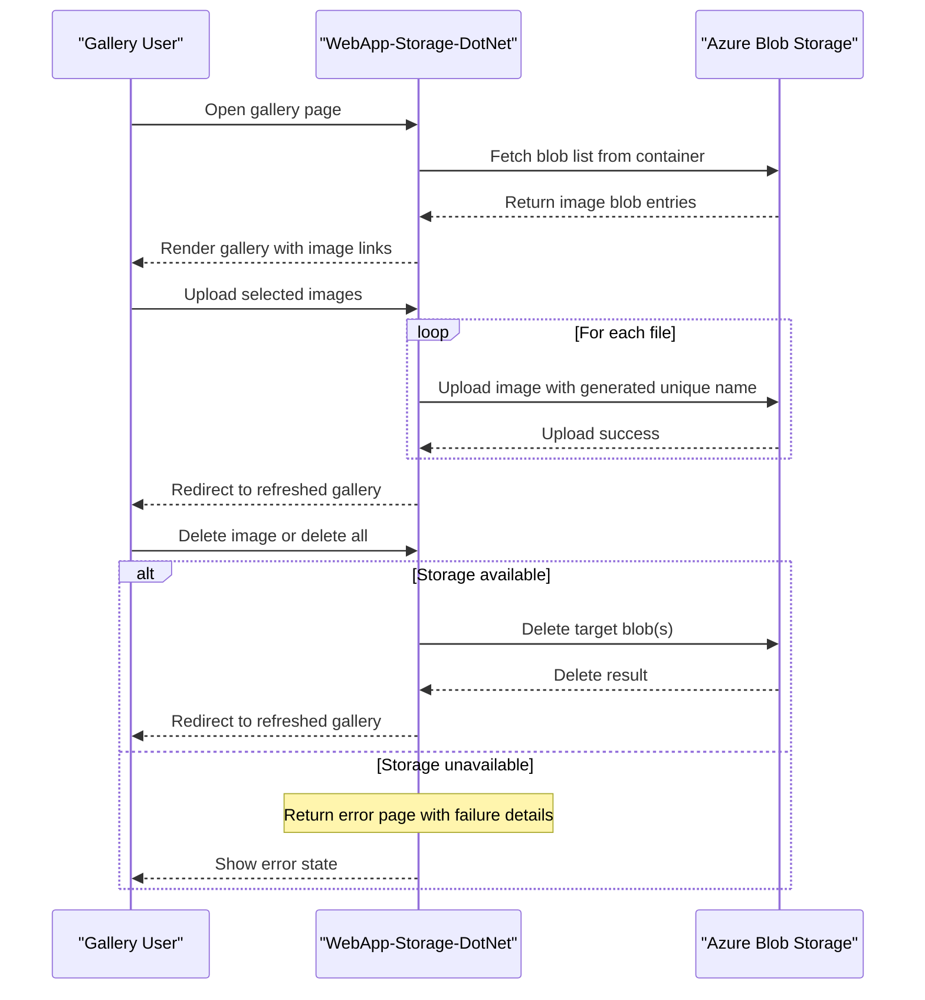

# Core Business Workflows

The application supports a simple media-management workflow where users upload, view, and remove photos from a cloud-backed gallery. The primary business value is lightweight image hosting and retrieval through a browser interface.

## Domain Entities

| Entity | Service / Bounded Context | Description | Key Relationships |
|---|---|---|---|
| Gallery | WebApp-Storage-DotNet / Photo Management | Logical collection of uploaded photos shown to user | Contains many Photo assets |
| Photo | WebApp-Storage-DotNet / Photo Management | Uploaded image asset stored in blob storage | Belongs to one Gallery container |
| Storage Container | WebApp-Storage-DotNet / Storage Integration | Blob container used as source of truth for photos | Holds many Photo blobs |

## Service-to-Domain Mapping

| Service | Domain Context | Owned Entities | External Dependencies |
|---|---|---|---|
| WebApp-Storage-DotNet | Photo Management | Gallery, Photo (logical), Storage Container reference | Azure Blob Storage service |

## Primary Workflows

### Workflow 1: Browse Photo Gallery

1. User opens the gallery home page.
2. System initializes storage container client if needed.
3. System reads current blob list and converts each blob to a URL.
4. System renders gallery page with available images.

Business rules involved: only block blobs are included in gallery listing.

### Workflow 2: Upload Photos

1. User selects one or more files and submits upload form.
2. System iterates files and assigns randomized blob names.
3. System uploads each file to blob storage.
4. User is redirected to updated gallery view.

Business rules involved: each upload receives a unique generated name to reduce collisions.

### Workflow 3: Delete Photos

1. User requests delete for one photo or all photos.
2. System resolves blob name(s) from URI/listing.
3. System deletes matching blobs if they exist.
4. User is redirected to refreshed gallery.

Business rules involved: delete operations are idempotent via `DeleteIfExists` semantics.

## Cross-Service Data Flows

Cross-service flow is minimal and point-to-point: the web app calls Azure Blob Storage for read/write operations and composes gallery responses from blob metadata and URIs. There is no service aggregation layer; when storage is unavailable, the user is routed to an error view with exception details.

## Business Workflow Sequence

## Business Rules & Decision Logic

- Only blobs identified as block blobs are shown in gallery listings.
- Uploaded files receive randomized names (`ticks + guid + extension`) before persistence.
- Delete actions follow idempotent behavior by deleting only when blob exists.
- Error handling catches exceptions in each workflow and routes user to a shared error page.
- No business-level authorization rules are present; all workflows are publicly reachable through the web app routes.
