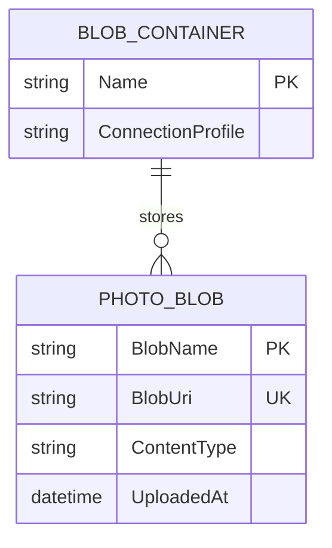

# Data Architecture & Persistence Layer

The data layer is blob-storage centric with no relational ORM or DbContext model. Persistence is implemented through Azure Blob Storage clients and URI-based references to image objects.

## Database Configuration

| Service/Module | DB Type | Profile | Driver | Connection | Migration Tool |
|---|---|---|---|---|---|
| WebApp-Storage-DotNet | Azure Blob Storage (object store) | Default | Azure.Storage.Blobs SDK | `StorageConnectionString` app setting (defaults to emulator) | None |

## Data Ownership per Service

| Service | Tables Owned | ORM Framework | Caching | Notes |
|---|---|---|---|---|
| WebApp-Storage-DotNet | None (blob container objects only) | None | None | Owns blob objects in container `webappstoragedotnet-imagecontainer` |

## Entity Model

## Key Repository Methods

| Service | Repository | Notable Methods | Purpose |
|---|---|---|---|
| WebApp-Storage-DotNet | BlobContainerClient usage in HomeController | `GetBlobs()`, `GetBlobClient(name)`, `CreateIfNotExistsAsync()` | Initialize container and enumerate stored images |
| WebApp-Storage-DotNet | BlobClient usage in HomeController | `UploadAsync(path)`, `DeleteIfExistsAsync()` | Upload and remove image blobs |

## Caching Strategy

No explicit application caching layer was detected (no Redis, MemoryCache abstraction, or cache annotations). The app reads current blob state directly from storage on each relevant request.

## Data Ownership Boundaries

The solution is a single service with a single data store boundary (Azure Blob container). There is no cross-service database access or CQRS split. Read/write operations happen directly from `HomeController` against blob storage via the Azure SDK.

### Data Classification & Sensitivity

| Entity | Sensitive Fields | Classification (PII/PHI/PCI/None) | Controls in Place |
|---|---|---|---|
| PHOTO_BLOB | File names and public blob URIs may include user-provided identifiers | PII (potential, low confidence) | No explicit masking or field-level controls in app code |
| BLOB_CONTAINER | None | None | N/A |
