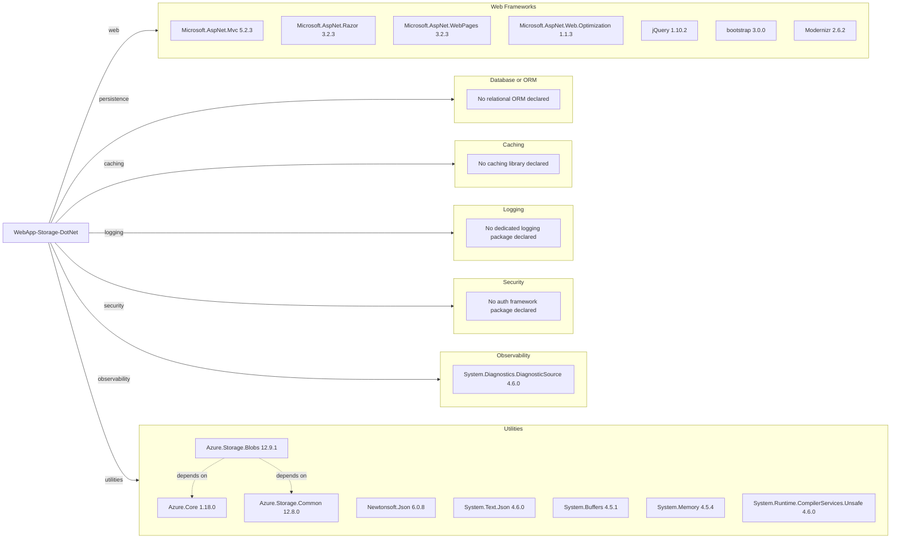

# Dependency Map

This project (`WebApp-Storage-DotNet`) declares approximately 34 NuGet dependencies, centered on ASP.NET MVC and Azure Blob Storage integration.

## Dependencies

### Dependency Summary

| Category | Count | Key Libraries | Notes |
|---|---:|---|---|
| Web Frameworks | 7 | ASP.NET MVC 5.2.3, Razor 3.2.3, WebPages 3.2.3 | Legacy ASP.NET MVC stack on .NET Framework |
| Database or ORM | 0 | None | No relational persistence layer in this app |
| Messaging | 0 | None | No queue or broker client libraries declared |
| Caching | 0 | None | No dedicated caching package declared |
| Logging | 0 | None | Relies on default framework logging/error pages |
| Security | 0 | None | No explicit auth package in dependencies |
| Observability | 1 | DiagnosticSource 4.6.0 | Low observability footprint |
| Utilities | 8 | Azure.Storage.Blobs 12.9.1, Azure.Core 1.18.0, Newtonsoft.Json 6.0.8 | Mix of Azure SDK and base runtime helper libs |

### Version & Compatibility Risks

The project uses .NET Framework 4.8 with older ASP.NET MVC-era packages and frontend libraries (notably jQuery 1.10.2 and Bootstrap 3.0.0), which increase modernization and security maintenance risk. Newtonsoft.Json 6.0.8 is also significantly behind current supported versions.

### Notable Observations

- Azure Blob Storage SDK is modern relative to the older ASP.NET MVC application stack.
- Both `Newtonsoft.Json` and `System.Text.Json` are present, indicating potential serialization inconsistency.
- No explicit authentication/authorization dependency is declared.
- Several packages are legacy-era versions tied to classic ASP.NET tooling.

## Test Dependencies

| Framework | Version | Notes |
|---|---|---|
| None detected | N/A | No test-scoped packages found in `packages.config` |

Total test-scope dependencies: 0

No test infrastructure dependencies were detected from declared package metadata.
