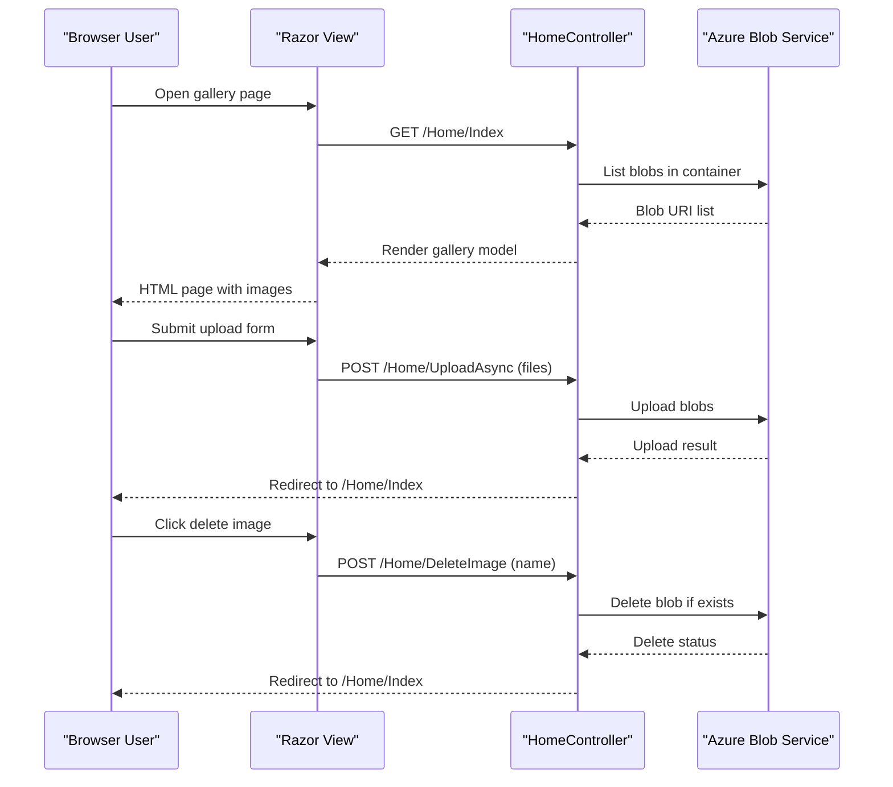

# API & Service Communication Contracts

The application exposes a small server-rendered HTTP surface for image gallery operations and communicates synchronously with Azure Blob Storage using SDK client calls.

## Service Catalog

| Service | Port | Category | Purpose |
|---|---:|---|---|
| WebApp-Storage-DotNet | 20050 (IIS Express dev URL) | API Layer | Hosts MVC actions for image listing, upload, and deletion |
| Azure Blob Storage | 443 | Infrastructure | Stores and serves uploaded image blobs |

## API Endpoints Inventory

| Service | Method | Path | Request Type | Response Type |
|---|---|---|---|---|
| HomeController | GET | `/Home/Index` (default route `/`) | None | Razor HTML view with `List<Uri>` model |
| HomeController | POST | `/Home/UploadAsync` | Multipart form files (`Request.Files`) | Redirect to Index |
| HomeController | POST | `/Home/DeleteImage` | Form field `name` (blob URI string) | Redirect to Index |
| HomeController | POST | `/Home/DeleteAll` | None | Redirect to Index |

## Management & Observability Endpoints

| Service | Endpoint | Custom Metrics (if any) |
|---|---|---|
| WebApp-Storage-DotNet | None explicitly configured | None detected |

## DTOs & Contracts

The API contract is form-based rather than JSON DTO based. `List<Uri>` acts as the primary response model for gallery rendering in the index view, while upload and delete operations use primitive form parameters (`Request.Files`, `name`) and redirect responses. No OpenAPI, protobuf, or GraphQL schema files were found.

## Communication Patterns

Communication is synchronous. Browser requests invoke MVC controller actions, which then call Azure Blob Storage SDK methods (`CreateIfNotExistsAsync`, `UploadAsync`, `DeleteIfExistsAsync`) directly. No asynchronous message broker patterns, retries, circuit breakers, or service discovery mechanisms were found. Startup availability depends on web app initialization and a valid `StorageConnectionString`. Security posture: no API-level authentication/authorization or TLS termination configuration is defined in application code; endpoint protection is expected to rely on hosting environment configuration.

## Service Technology Matrix

| Service | Web | Data Access | Discovery | Gateway | Actuator | Cache | Metrics |
|---|---|---|---|---|---|---|---|
| WebApp-Storage-DotNet | ASP.NET MVC 5 | Azure.Storage.Blobs SDK | None | None | None | None | None |
| Azure Blob Storage | N/A | Blob service API | N/A | N/A | N/A | Managed by service | Service-level metrics outside app |

## Service Communication Sequence

