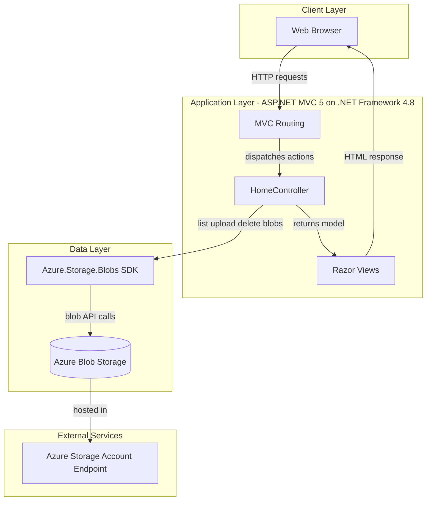
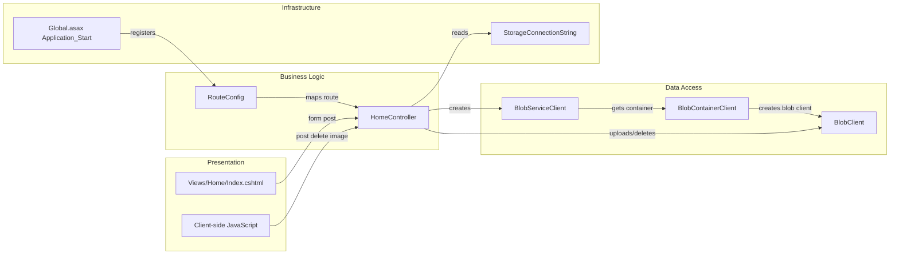

# Architecture Diagram

This application is a single-service ASP.NET MVC web app that serves a browser UI and performs direct blob operations against Azure Storage.

## Application Architecture

### Technology Stack Summary

| Layer | Technology | Version | Purpose |
|---|---|---|---|
| Presentation | ASP.NET MVC + Razor | MVC 5.2.3 | Serves gallery UI and accepts file operations |
| Application | C# async controller actions | .NET Framework 4.8 | Coordinates upload, listing, and delete workflows |
| Data Access | Azure Storage Blob SDK | 12.9.1 | Performs blob container and blob operations |
| Configuration | Web.config appSettings | N/A | Stores storage connection string and runtime settings |

### Data Storage & External Services

The app stores image data in a single Azure Blob Storage container (`webappstoragedotnet-imagecontainer`) and interacts directly with the storage account endpoint through the Azure Blob client SDK.

### Key Architectural Decisions

- Uses a simple server-rendered MVC pattern with one primary controller and one view.
- Uses direct SDK calls from controller actions instead of a separate repository/service layer.
- Uses a storage connection string in application settings to switch between emulator and cloud storage.

## Component Relationships

### Component Inventory

| Component | Layer | Type | Responsibility |
|---|---|---|---|
| Global.asax | Infrastructure | Application bootstrap | Registers filters, routes, and bundles |
| RouteConfig | Business Logic | Routing config | Maps default `{controller}/{action}/{id}` route |
| HomeController | Business Logic | MVC Controller | Lists blobs, uploads files, deletes blobs |
| Views/Home/Index.cshtml | Presentation | Razor view | Displays gallery and upload/delete controls |
| Client-side JS in Index view | Presentation | Browser script | Invokes delete endpoint and updates upload list UI |
| BlobServiceClient/BlobContainerClient/BlobClient | Data Access | Azure SDK clients | Executes blob CRUD operations |
| Web.config appSettings | Infrastructure | Configuration source | Supplies storage connection string |
