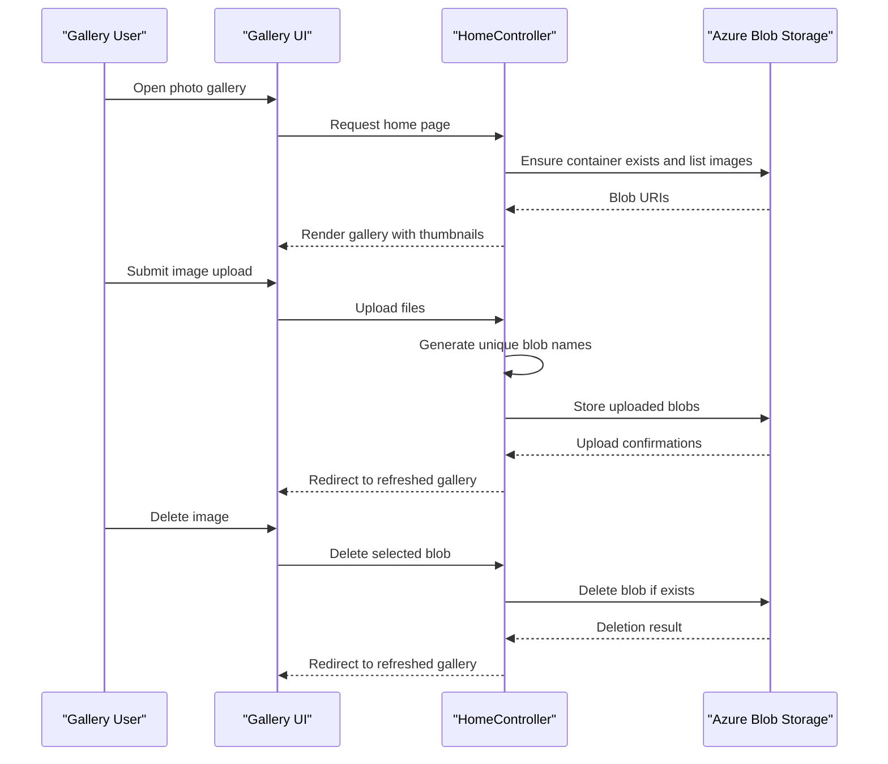

# Core Business Workflows

The application supports a photo gallery workflow where users upload, browse, and delete images backed by Azure Blob Storage.

## Domain Entities

| Entity | Service / Bounded Context | Description | Key Relationships |
|---|---|---|---|
| Gallery | WebApp-Storage-DotNet / Photo Management | Represents the rendered collection of stored images | Contains many image blobs |
| Image Blob | WebApp-Storage-DotNet / Photo Management | Stored photo object in blob container | Belongs to one container/gallery |
| Upload Request | WebApp-Storage-DotNet / Photo Management | User-submitted multipart file batch | Produces one or more image blobs |

## Service-to-Domain Mapping

| Service | Domain Context | Owned Entities | External Dependencies |
|---|---|---|---|
| WebApp-Storage-DotNet | Photo Management | Gallery, Image Blob, Upload Request | Azure Blob Storage service |

## Primary Workflows

### Workflow 1: Browse gallery images

User loads the gallery page, controller initializes storage client, ensures container existence, retrieves blob list, and returns a view showing image thumbnails and actions.

### Workflow 2: Upload images

User selects multiple files and submits the upload form. The controller iterates over files, generates unique blob names, uploads each file, and redirects back to gallery for refreshed listing.

### Workflow 3: Delete single or all images

User triggers delete from gallery UI. The controller deletes a selected blob or iterates all blobs for bulk delete, then redirects to gallery.

## Cross-Service Data Flows

The only cross-service flow is between the web application and Azure Blob Storage. Gallery data is composed from blob URIs returned by blob listing operations; no additional downstream services are queried and no fallback composition path is required.

## Business Workflow Sequence

## Business Rules & Decision Logic

- Only block blobs are shown in gallery listings.
- Upload operations process all submitted files and assign randomized unique blob names.
- Delete operations are idempotent (`DeleteIfExists`) to avoid failures for already removed blobs.
- Error handling catches exceptions and routes users to an error view with diagnostic message/trace.
