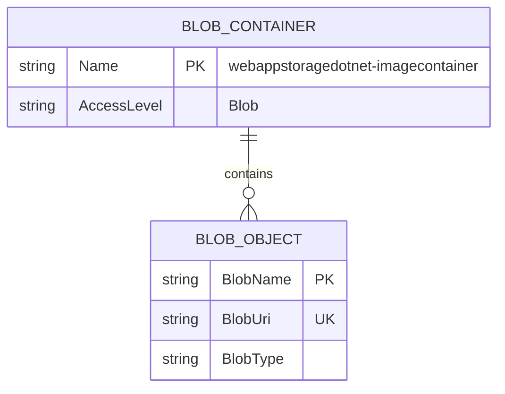

# Data Architecture & Persistence Layer

The data layer is centered on Azure Blob Storage rather than a relational database, with persistence handled through Azure SDK clients and no ORM entity model.

## Database Configuration

| Service/Module | DB Type | Profile | Driver | Connection | Migration Tool |
|---|---|---|---|---|---|
| WebApp-Storage-DotNet | Azure Blob Storage (object store) | Default | Azure.Storage.Blobs SDK | `StorageConnectionString` from app settings | None |

## Data Ownership per Service

| Service | Tables Owned | ORM Framework | Caching | Notes |
|---|---|---|---|---|
| WebApp-Storage-DotNet | Blob container `webappstoragedotnet-imagecontainer` | None (SDK-based access) | None detected | Owns image object lifecycle (create/list/delete) |

## Entity Model

## Key Repository Methods

| Service | Repository | Notable Methods | Purpose |
|---|---|---|---|
| WebApp-Storage-DotNet | HomeController direct SDK usage | `GetBlobs()`, `UploadAsync(...)`, `DeleteIfExistsAsync()`, `DeleteBlobIfExistsAsync(...)` | Implements blob persistence operations without repository abstraction |

## Caching Strategy

No application-level caching provider or cache annotations were detected. Blob listing and object operations are executed directly against Azure Storage each request.

## Data Ownership Boundaries

A single application directly owns and accesses one blob container. There are no cross-service database boundaries, shared relational schemas, or CQRS patterns in the current implementation.

### Data Classification & Sensitivity

| Entity | Sensitive Fields | Classification (PII/PHI/PCI/None) | Controls in Place |
|---|---|---|---|
| Blob object metadata (URI/name) | File names may contain user-supplied text | PII (potential) | No explicit masking/encryption controls in application code |
| Uploaded image content | Image binary payload | PII (potential) | Relies on storage account controls; no app-level field controls |
