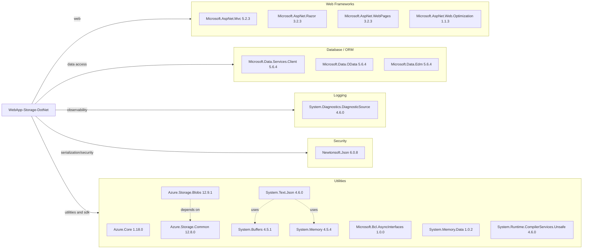

# Dependency Map

This project is a .NET Framework ASP.NET MVC web app with 18 primary runtime dependencies declared in `packages.config`, centered on MVC, Azure Storage, and utility libraries.

## Dependencies

### Dependency Summary

| Category | Count | Key Libraries | Notes |
|---|---:|---|---|
| Web Frameworks | 4 | Microsoft.AspNet.Mvc, Microsoft.AspNet.Razor | Legacy ASP.NET MVC 5 stack on .NET Framework |
| Database / ORM | 3 | Microsoft.Data.Services.Client, OData | OData client libraries are present; no EF/ORM usage in app code |
| Logging | 1 | System.Diagnostics.DiagnosticSource | Basic diagnostics infrastructure |
| Security | 1 | Newtonsoft.Json | Older JSON library version |
| Utilities | 9 | Azure.Storage.Blobs, Azure.Core, System.Text.Json | Includes Azure Blob SDK plus low-level support packages |

### Version & Compatibility Risks

The project targets .NET Framework 4.8 with several older package versions (for example Newtonsoft.Json 6.0.8 and ASP.NET MVC 5.2.3), which may require API and package modernization when moving to .NET 8+ or ASP.NET Core.

### Notable Observations

- Both `System.Text.Json` and `Newtonsoft.Json` are referenced, indicating potentially mixed JSON stacks.
- Azure storage integration is implemented through Track 2 SDK packages (`Azure.Storage.Blobs 12.x`).
- Build still relies on `packages.config`, which is legacy compared with SDK-style `PackageReference`.
- No dedicated resilience/circuit-breaker libraries are declared.

## Test Dependencies

| Framework | Version | Notes |
|---|---|---|
| None detected | N/A | No test-specific packages were found in `packages.config` |

Total test-scope dependencies: 0
No test dependencies were detected in the project manifest.
