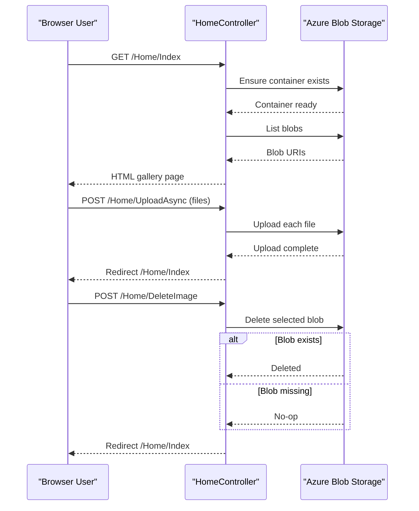

# API & Service Communication Contracts

The application exposes a small server-rendered MVC contract with one main page route and three POST actions for blob operations. Communication is synchronous between browser and app, and synchronous SDK calls to Azure Blob Storage with async method usage in controller code.

## Service Catalog

| Service | Port | Category | Purpose |
|---|---|---|---|
| WebApp-Storage-DotNet | IIS Express dynamic local port (sample shows `http://localhost:20050`) | API Layer | Renders photo gallery and handles upload/delete actions |
| Azure Blob Storage Account | HTTPS 443 | Infrastructure | Persists image objects in blob container |

## API Endpoints Inventory

| Service | Method | Path | Request Type | Response Type |
|---|---|---|---|---|
| WebApp-Storage-DotNet | GET | `/Home/Index` (default route target) | None | HTML view with `List<Uri>` model |
| WebApp-Storage-DotNet | POST | `/Home/UploadAsync` | `multipart/form-data` file collection (`Request.Files`) | Redirect to `Index` |
| WebApp-Storage-DotNet | POST | `/Home/DeleteImage` | Form field `Name` containing blob URL | Redirect to `Index` |
| WebApp-Storage-DotNet | POST | `/Home/DeleteAll` | No body payload | Redirect to `Index` |

## Management & Observability Endpoints

| Service | Endpoint | Custom Metrics (if any) |
|---|---|---|
| WebApp-Storage-DotNet | None explicitly defined | None detected |

## DTOs & Contracts

The API surface is MVC-action based and does not define dedicated request/response DTO classes. Inputs are model-bound primitives (`string name`) or direct `HttpFileCollectionBase` access from the request, while the primary response contract is a Razor-rendered HTML page. Serialization configuration is framework-default for MVC; no OpenAPI/Swagger, protobuf, or GraphQL contract artifacts were found.

## Communication Patterns

Browser-to-application communication uses synchronous HTTP routes following MVC conventions, and the controller executes asynchronous blob operations using Azure SDK methods (`CreateIfNotExistsAsync`, `UploadAsync`, `DeleteIfExistsAsync`). No asynchronous messaging, service discovery, API gateway, circuit breaker, retry policy, or timeout policy libraries were identified in code/config. Security posture at API contract level is minimal: no explicit authentication/authorization attributes or TLS enforcement configuration were found in the app code, so endpoint access is effectively governed by host/environment configuration rather than in-app policy.

## Service Technology Matrix

| Service | Web | Data Access | Discovery | Gateway | Actuator | Cache | Metrics |
|---|---|---|---|---|---|---|---|
| WebApp-Storage-DotNet | ASP.NET MVC 5 | Azure Blob Storage SDK | None | None | None | None | None |
| Azure Blob Storage Account | Managed storage API | Blob object store | N/A | N/A | N/A | N/A | N/A |

## Service Communication Sequence

