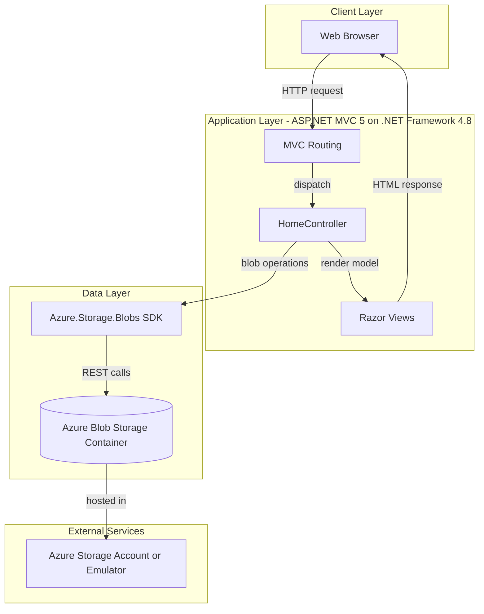
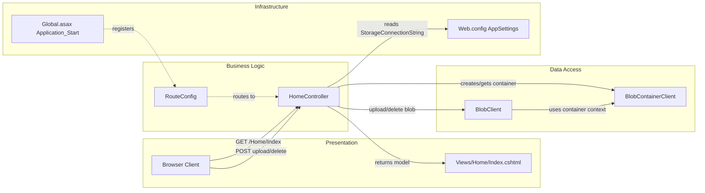

# Architecture Diagram

This application is a single ASP.NET MVC web application that serves a photo gallery UI and stores image files in Azure Blob Storage. The architecture is a classic MVC web tier with direct cloud storage integration.

## Application Architecture

### Technology Stack Summary

| Layer | Technology | Version | Purpose |
|---|---|---|---|
| Presentation | ASP.NET MVC + Razor | MVC 5.2.3 | Web UI and request handling |
| Application | .NET Framework | 4.8 target in project | Runtime for controller/business flow |
| Data Access | Azure.Storage.Blobs | 12.9.1 | Blob container and blob CRUD |
| Client Assets | jQuery + Bootstrap | jQuery 1.10.2, Bootstrap 3.0.0 | UI behavior and styling |

### Data Storage & External Services

The application persists photo binaries in a single Azure Blob Storage container (`webappstoragedotnet-imagecontainer`) and reads connection information from `Web.config` app settings. No relational database, queue, or cache is configured.

### Key Architectural Decisions

- Uses a single MVC controller (`HomeController`) as the orchestration point for list, upload, and delete flows.
- Stores media in object storage rather than on local disk.
- Uses asynchronous SDK calls for upload and delete operations against Blob Storage.

## Component Relationships

### Component Inventory

| Component | Layer | Type | Responsibility |
|---|---|---|---|
| Global.asax (MvcApplication) | Infrastructure | Startup | Registers MVC routes, filters, and bundles |
| RouteConfig | Business Logic | Routing config | Defines default `{controller}/{action}/{id}` route |
| HomeController | Business Logic | MVC Controller | Handles image listing, upload, and deletion workflows |
| Index.cshtml | Presentation | Razor View | Renders gallery and upload/delete UI |
| BlobContainerClient | Data Access | SDK client | Enumerates and manages blob container objects |
| BlobClient | Data Access | SDK client | Uploads and deletes individual image blobs |
| Web.config appSettings | Infrastructure | Configuration source | Supplies storage connection string and runtime settings |
