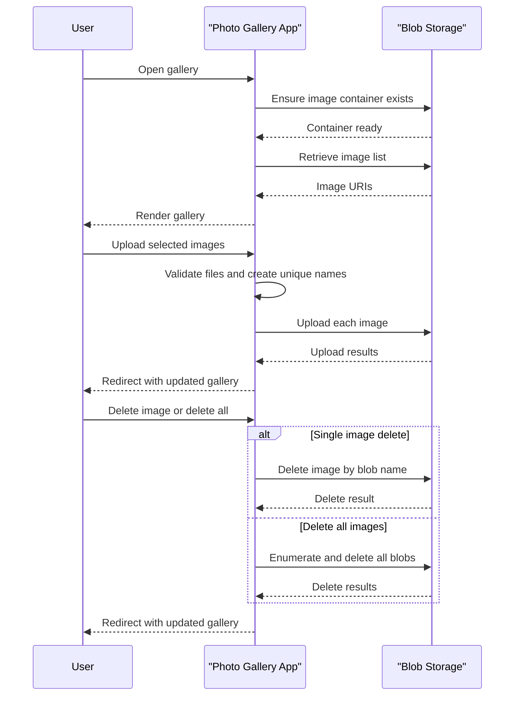

# Core Business Workflows

The application enables users to manage a web photo gallery by uploading images, viewing stored photos, and deleting one or all images. The business behavior is focused on media lifecycle management over Azure Blob Storage.

## Domain Entities

| Entity | Service / Bounded Context | Description | Key Relationships |
|---|---|---|---|
| Gallery | WebApp-Storage-DotNet / Photo Management | Logical collection of all visible photos in the UI | Contains many Image assets |
| Image Asset | WebApp-Storage-DotNet / Photo Management | User-uploaded media item persisted in blob storage | Belongs to one Gallery |
| Storage Container | WebApp-Storage-DotNet / Storage Access | Backing container holding all image blobs | Stores many Image assets |

## Service-to-Domain Mapping

| Service | Domain Context | Owned Entities | External Dependencies |
|---|---|---|---|
| WebApp-Storage-DotNet | Photo Management | Gallery, Image Asset, Storage Container mapping | Azure Blob Storage service |

## Primary Workflows

### Workflow 1: View gallery

1. User opens gallery page (default route to `Home/Index`).
2. Application ensures the image container exists.
3. Application retrieves blob list and maps items to image URIs.
4. Razor view renders all images and available delete actions.

Business rules involved: only block blobs are displayed; errors route to shared error view.

### Workflow 2: Upload images

1. User selects one or more files and submits upload form.
2. Application validates that at least one file is present.
3. For each file, app generates a unique blob name and uploads to storage.
4. User is redirected back to gallery to view updated image list.

Business rules involved: uploaded items are renamed with timestamp + GUID to avoid collisions.

### Workflow 3: Delete image(s)

1. User triggers single-item delete or delete-all action.
2. For single delete, app extracts blob file name from posted URI.
3. App deletes the selected blob (or iterates and deletes all blobs).
4. User is redirected to refreshed gallery page.

Business rules involved: delete operations are idempotent (`DeleteIfExists` semantics).

## Cross-Service Data Flows

There is no multi-service composition inside the repository. The sole cross-boundary flow is between the MVC app and Azure Blob Storage API: the application fetches blob metadata/URIs for display and issues upload/delete commands for state changes. If storage operations fail, the workflow degrades to an error view rather than partial data composition.

## Business Workflow Sequence

## Business Rules & Decision Logic

- Only images represented as block blobs are shown in gallery listings.
- Upload flow processes all submitted files and generates unique blob names to prevent overwrite collisions.
- Delete operations use if-exists semantics to avoid hard failure when blobs are already missing.
- Exception handling across workflows directs users to an error page with diagnostic details.
