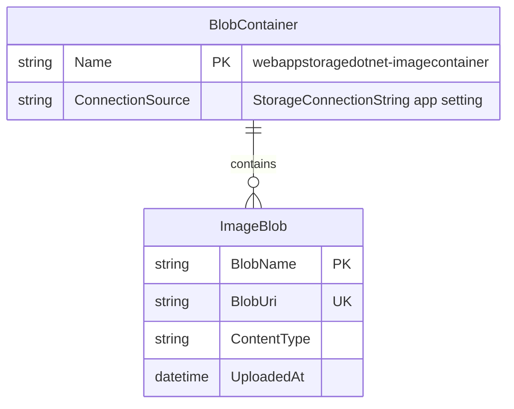

# Data Architecture & Persistence Layer

The data layer is centered on object storage rather than relational persistence, with image binaries stored in Azure Blob Storage and metadata inferred from blob URIs. No ORM entity model or relational schema is implemented in this codebase.

## Database Configuration

| Service/Module | DB Type | Profile | Driver | Connection | Migration Tool |
|---|---|---|---|---|---|
| WebApp-Storage-DotNet | Azure Blob Storage (object store) | Default (single config) | Azure.Storage.Blobs SDK 12.9.1 | App setting `StorageConnectionString` in `Web.config` (defaults to emulator) | None |

## Data Ownership per Service

| Service | Tables Owned | ORM Framework | Caching | Notes |
|---|---|---|---|---|
| WebApp-Storage-DotNet | None (blob objects only) | None | None | Owns a single blob container namespace for images |

## Entity Model

## Key Repository Methods

| Service | Repository | Notable Methods | Purpose |
|---|---|---|---|
| WebApp-Storage-DotNet | `HomeController` using `BlobContainerClient` / `BlobClient` | `GetBlobs()`, `UploadAsync(...)`, `DeleteIfExistsAsync()`, `DeleteBlobIfExistsAsync(...)` | List, upload, and delete image blobs in storage |

## Caching Strategy

No explicit caching provider or cache annotations were found. Each request directly queries blob storage for the current container contents.

## Data Ownership Boundaries

The application uses a single data boundary: the MVC app directly accesses its own blob container using the configured storage connection string. There are no additional services or cross-service data joins, and no CQRS-style read/write split.

### Data Classification & Sensitivity

| Entity | Sensitive Fields | Classification (PII/PHI/PCI/None) | Controls in Place |
|---|---|---|---|
| ImageBlob | File name and URI may contain user-provided identifiers | PII (potential) | No explicit masking/encryption controls in app code; relies on storage account and deployment security configuration |
| BlobContainer | Connection source reference (not secret value itself) | None | Connection value stored in config setting |
