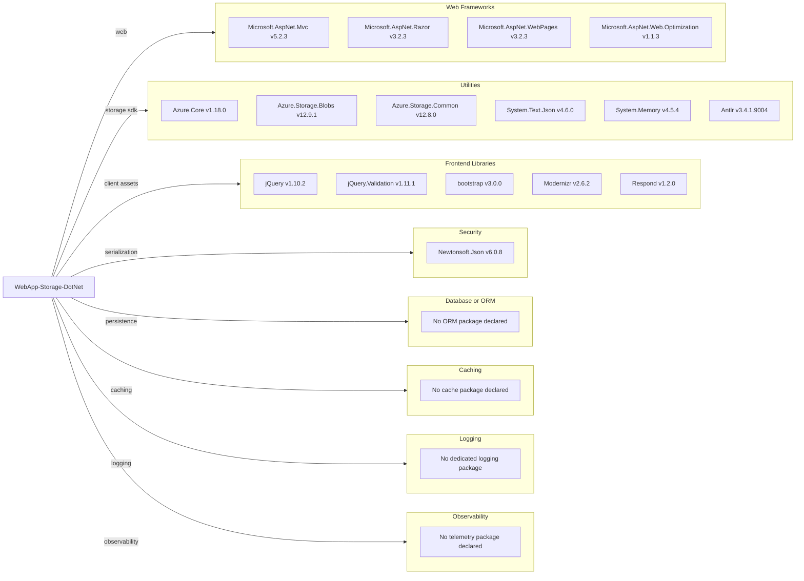

# Dependency Map

This project (`WebApp-Storage-DotNet`) declares 33 NuGet dependencies in `packages.config`, centered on ASP.NET MVC and Azure Blob Storage integration.

## Dependencies

### Dependency Summary

| Category | Count | Key Libraries | Notes |
|---|---:|---|---|
| Web Frameworks | 4 | Microsoft.AspNet.Mvc, Razor, WebPages | Classic ASP.NET MVC 5 stack |
| Utilities | 18 | Azure.Storage.Blobs, Azure.Core, System.* support packages | Includes Azure SDK and compatibility libraries |
| Frontend Libraries | 5 | jQuery, bootstrap, Modernizr | Legacy browser-oriented asset set |
| Security | 1 | Newtonsoft.Json | JSON serialization dependency |
| Database / ORM | 0 | None | No relational ORM/database package declared |
| Caching | 0 | None | No explicit caching library |
| Logging | 0 | None | Uses framework/default logging only |
| Observability | 0 | None | No metrics/tracing package declared |

### Version & Compatibility Risks

Several core packages are old relative to current ecosystem baselines (for example jQuery 1.10.2, Bootstrap 3.0.0, Newtonsoft.Json 6.0.8, and ASP.NET MVC 5-era packages). The project targets legacy .NET Framework and package management via `packages.config`, which increases migration and compatibility effort for modern .NET runtimes.

### Notable Observations

- Azure Blob SDK (`Azure.Storage.Blobs`) is newer than much of the MVC/UI stack, creating a mixed-generation dependency profile.
- No explicit data-layer ORM package is present; storage is blob-object centric.
- No dedicated observability or structured logging package was found.
- Compiler/tooling packages (`Microsoft.Net.Compilers`, `Microsoft.CodeDom.Providers.*`) indicate an older build pipeline.

## Test Dependencies

| Framework | Version | Notes |
|---|---|---|
| None detected | N/A | No test-scoped package entries found in `packages.config` |

Total test-scope dependencies: 0

No test dependency set was detected in this repository. The project appears to be application-only without a co-located automated test project.
