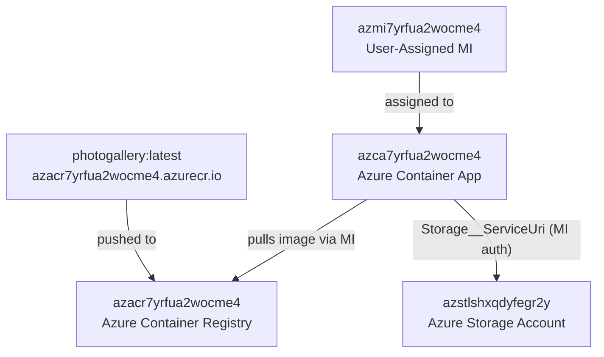

# Deployment Summary — PhotoGallery

## Overview
| Property | Value |
|---|---|
| Project | PhotoGallery (WebApp-Storage-DotNet) |
| Deployment Tool | Azure CLI (`az acr build` + `az containerapp update`) |
| Deploy Option | deploy-only (existing Azure resources) |
| Status | ✅ **Success** |
| Deployed At | 2026-07-16 |
| App URL | https://azca7yrfua2wocme4.wittycoast-d625364c.eastus2.azurecontainerapps.io |

---

## Deployed Image
| Property | Value |
|---|---|
| Registry | `azacr7yrfua2wocme4.azurecr.io` |
| Image | `azacr7yrfua2wocme4.azurecr.io/photogallery:latest` |
| Digest | `sha256:54e7d029392133c153a6bf91e8ea6e6fa0b723b3dc2742df4ac1c6d44950ca99` |
| Platform | linux/amd64 |
| Base (runtime) | `mcr.microsoft.com/dotnet/aspnet:10.0` |

---

## Azure Resources Configured



---

## Container App Configuration
| Setting | Value |
|---|---|
| Container App | `azca7yrfua2wocme4` |
| Resource Group | `rg-photogallery` |
| Image | `azacr7yrfua2wocme4.azurecr.io/photogallery:latest` |
| Registry Auth | User-Assigned Managed Identity (`azmi7yrfua2wocme4`) |
| `Storage__ServiceUri` | `https://azstlshxqdyfegr2y.blob.core.windows.net` |
| `AZURE_CLIENT_ID` | `89dc1e32-a5a1-4dcd-b41e-a94c8d172db1` |
| provisioningState | Succeeded |
| runningStatus | Running |
| Port | 8080 |

---

## Files Created
| File | Description |
|---|---|
| `WebApp-Storage-DotNet/Dockerfile` | Multi-stage Dockerfile (.NET 10 SDK → ASP.NET runtime, non-root user, port 8080) |
| `WebApp-Storage-DotNet/.dockerignore` | Excludes bin/obj for sub-folder context |
| `.dockerignore` | Root-level ignore file excluding `WebApp-Storage-DotNet/bin/` and `obj/` for clean ACR builds |
| `deploy-scripts/deploy.ps1` | PowerShell script for repeatable deployments (ACR build + CA update) |
| `plan.md` | Full deployment plan |
| `progress.md` | Step-by-step progress log |

---

## Build Attempts
| Attempt | Outcome | Root Cause |
|---|---|---|
| ch1 | ❌ Failed | Windows-cached NuGet restore assets (obj/ copied into image) |
| ch2 | ❌ Failed | Alpine `addgroup`/`adduser` used on Debian base image |
| ch3 | ✅ Success | Root `.dockerignore` excludes `bin/`+`obj/`; Debian-compatible `groupadd`/`useradd` |

---

## App Logs (Post-Deployment)
```
Application started. Press Ctrl+C to shut down.
Now listening on: http://[::]:8080
Hosting environment: Production
Content root path: /app
```
> No errors in startup logs. Application is healthy.
