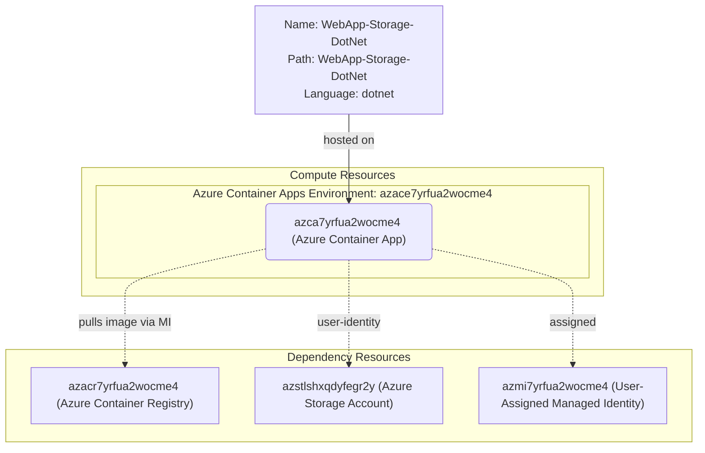

# Azure Deployment Plan for PhotoGallery Project

## **Goal**
Deploy the PhotoGallery ASP.NET Core 10.0 web application to an existing Azure Container App (`azca7yrfua2wocme4`) in resource group `rg-photogallery`, subscription `0dc80431-5546-4681-a92a-2a799ade5139`, using Azure CLI.

---

## **Project Information**

**WebApp-Storage-DotNet**
- **Stack**: ASP.NET Core 10.0 MVC
- **Type**: Photo Gallery web app using Azure Blob Storage
- **Containerization**: Dockerfile to be generated at `WebApp-Storage-DotNet/Dockerfile`
- **Dependencies**: Azure.Identity, Azure.Storage.Blobs, Microsoft.Extensions.Azure
- **Auth to Storage**: DefaultAzureCredential (Managed Identity — no connection strings)
- **Hosting**: Azure Container Apps

---

## **Azure Resources Architecture**

> **Install the mermaid extension in IDE to view the architecture.**

---

## **Existing Azure Resources**

| Resource Type | Name | SKU | Purpose |
|---|---|---|---|
| Container App | `azca7yrfua2wocme4` | Consumption | Hosts the PhotoGallery web app |
| Container Apps Environment | `azace7yrfua2wocme4` | Consumption | ACA environment |
| Azure Container Registry | `azacr7yrfua2wocme4` | — | Stores container images; login: `azacr7yrfua2wocme4.azurecr.io` |
| User-Assigned Managed Identity | `azmi7yrfua2wocme4` | — | Pull images from ACR; access Storage Blob; Client ID: `89dc1e32-a5a1-4dcd-b41e-a94c8d172db1` |
| Storage Account | `azstlshxqdyfegr2y` | — | Blob storage for photos (Storage Blob Data Contributor assigned to MI) |
| Log Analytics Workspace | `azlaw7yrfua2wocme4` | Standard | Log aggregation for Container Apps |

**Missing Resources:** None — all required resources are provisioned.

---

## **Execution Steps**

> **Below are the steps for Copilot to follow. Add check list for the steps.**
> **CRITICAL: Do NOT run `az login` until 'Env setup' step.**

### Step 1 — Containerization
- [ ] Generate `WebApp-Storage-DotNet/Dockerfile` (multi-stage, linux/amd64, .NET 10 SDK → ASP.NET runtime, non-root user)
- [ ] Generate `WebApp-Storage-DotNet/.dockerignore`
- [ ] Build image via `az acr build` (remote ACR build — no local Docker required)
- **Output**: `WebApp-Storage-DotNet/Dockerfile`

### Step 2 — Env Setup for AzCLI
- [ ] Verify `az` CLI is installed
- [ ] Set active subscription: `az account set --subscription 0dc80431-5546-4681-a92a-2a799ade5139`
- [ ] Install serviceconnector-passwordless extension

### Step 3 — Provisioning
- No new resources required; all Azure resources are already provisioned.

### Step 4 — Check Azure Resources Existence
- [ ] Azure Container Registry `azacr7yrfua2wocme4` — `az acr show`
- [ ] Container Apps Environment `azace7yrfua2wocme4` — `az containerapp env show`
- [ ] Container App `azca7yrfua2wocme4` — `az containerapp show`
- [ ] User-Assigned Managed Identity `azmi7yrfua2wocme4` — `az identity show`

### Step 5 — Deployment
- [ ] Build & push image to ACR via `az acr build`
- [ ] Update Container App: set new image, attach registry pull identity (user-assigned MI), set env var `Storage__ServiceUri`
- [ ] Verify app is running: `az containerapp show` → `runningStatus: Running`
- [ ] Validate app logs via `appmod-get-app-logs`
- **Output**: `deploy-scripts/deploy.ps1`

### Step 6 — Summarize Result
- [ ] Call `appmod-summarize-result` tool
- [ ] Generate `deployment-summary.md`
- [ ] Generate `modernization-summary.md`

---

## **Progress Tracking**
See `progress.md` for real-time updates.

---

## **Tools Checklist**
- [ ] appmod-analyze-repository ✅
- [ ] appmod-plan-generate-dockerfile ✅
- [ ] appmod-build-docker-image (using `az acr build` instead — remote build)
- [ ] appmod-summarize-result
- [ ] appmod-get-app-logs
